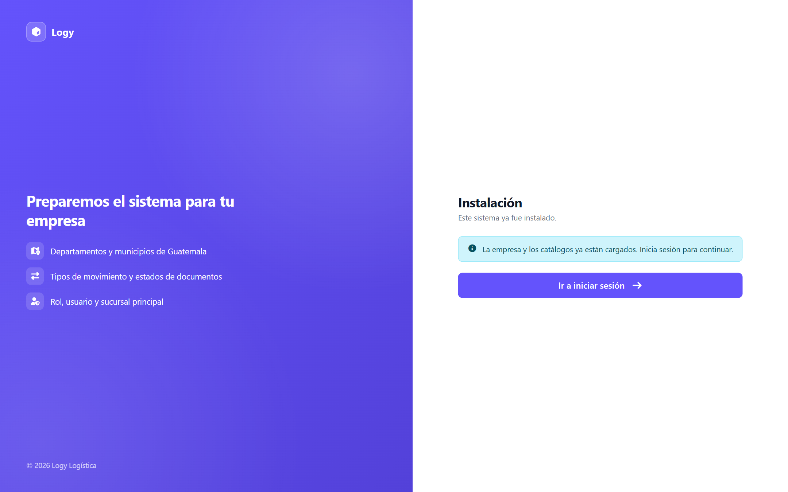
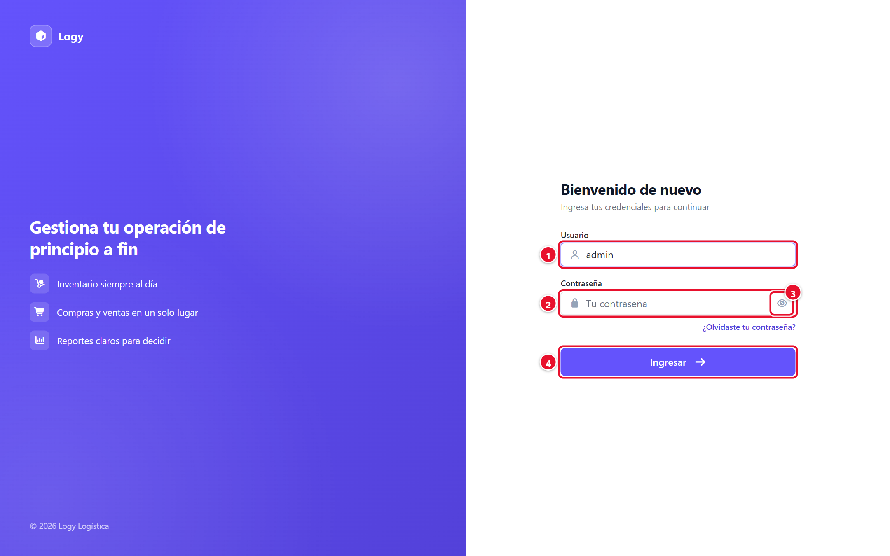
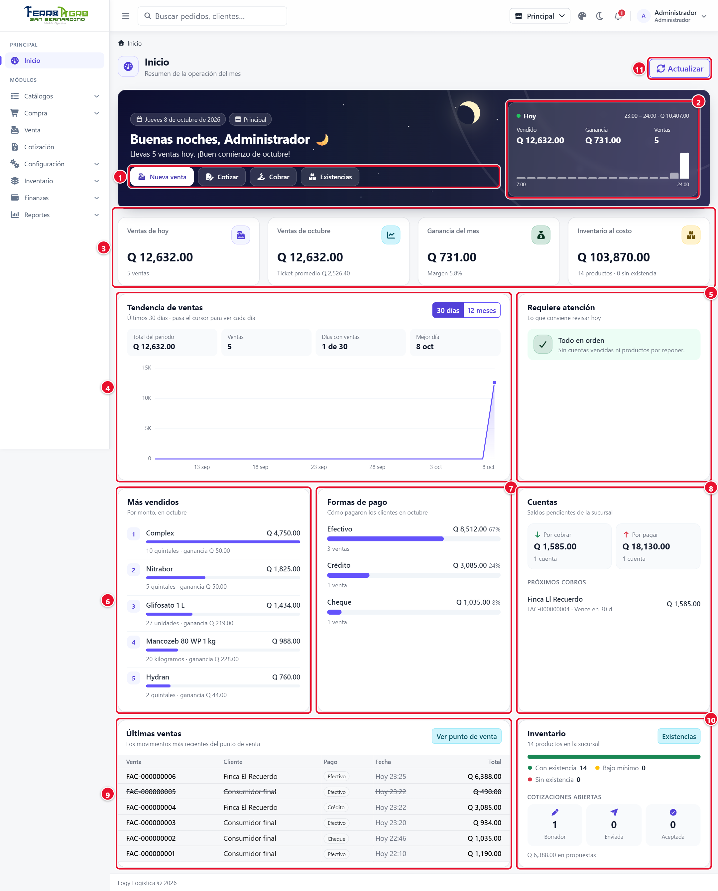
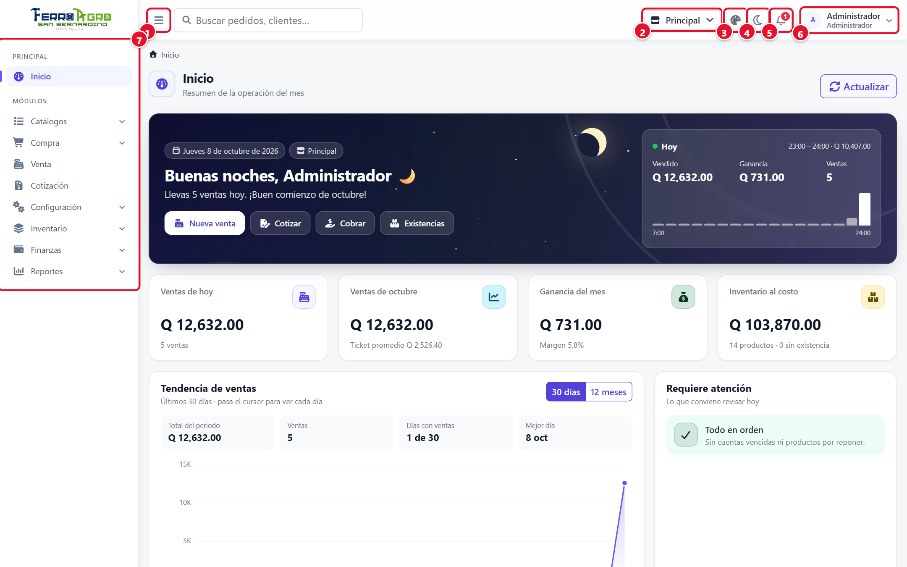
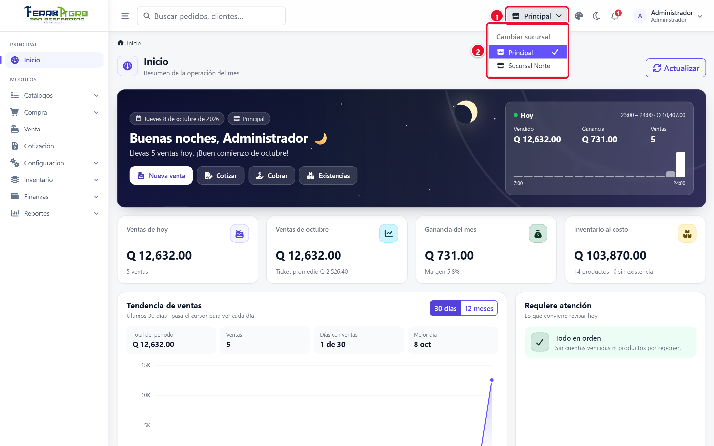
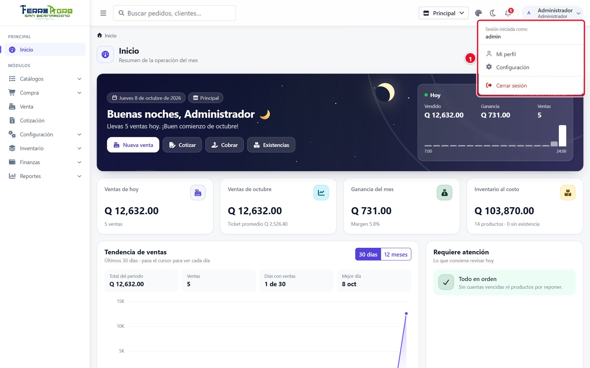
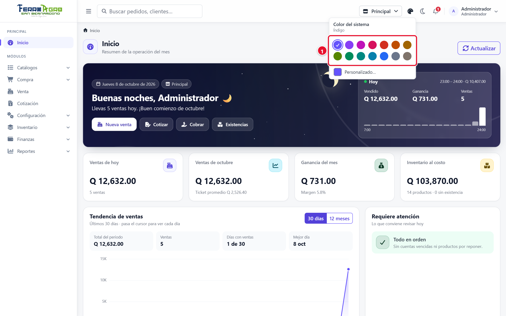
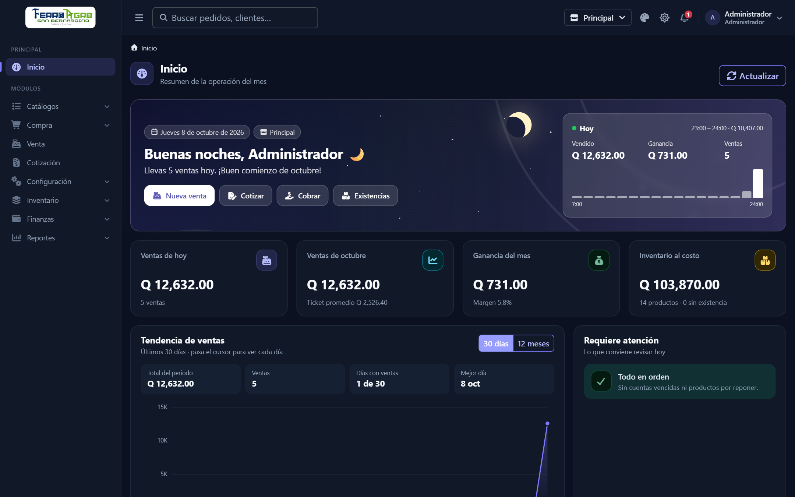
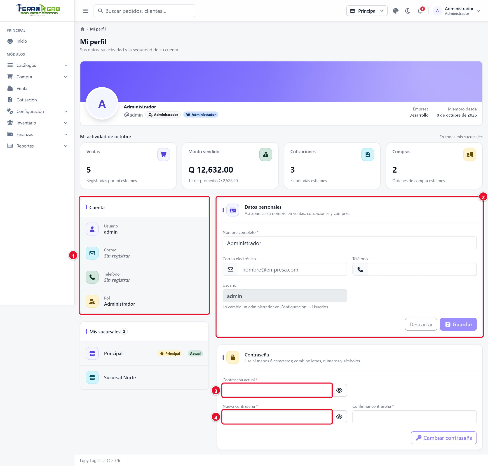
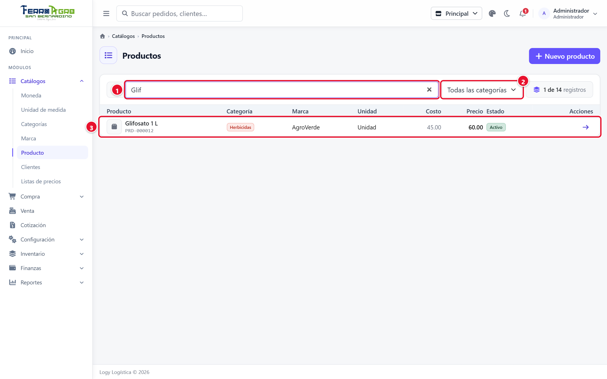

# 1 · Primeros pasos

[← Índice](README.md)

## Instalación

La instalación se hace **una sola vez**, cuando la empresa empieza a usar Logy. Si el sistema ya está instalado, la pantalla lo indica con el mensaje *"Este sistema ya fue instalado."* y lo lleva a iniciar sesión.

1. Abra la dirección del sistema seguida de `/instalacion`.
2. Llene los datos de la empresa (los campos con * son obligatorios):
   - **Nombre comercial** *
   - **Razón social** *
   - **NIT** *
   - **Teléfono** y **Correo**
   - **Departamento** *, **Municipio** * y **Dirección** *
3. Pulse **Instalar**.
4. Al terminar verá **Instalación completada**. El sistema carga los catálogos básicos (monedas, unidades de medida con sus equivalencias, formas de pago, estados, tipos de ajuste, el menú…), crea una sucursal llamada **Principal** (con la dirección de la empresa), el cliente **Consumidor final (CF)** y el usuario administrador.
5. Pulse **Ir a iniciar sesión** y entre con el usuario **admin** y la contraseña **admin**.

<!-- figura -->

<!-- /figura -->

> **Importante**: cambie la contraseña de `admin` en cuanto entre por primera vez ([Mi perfil](#mi-perfil)).

## Iniciar sesión

1. Escriba su **usuario** y su **contraseña**. El ojo al lado de la contraseña la muestra u oculta.
2. Pulse **Ingresar**.

<!-- figura -->

- **①** **Usuario**: el nombre con el que entra (ej. *admin*).
- **②** **Contraseña**.
- **③** Ojo: muestra u oculta la contraseña mientras la escribe.
- **④** **Ingresar**.

<!-- /figura -->

- Si los datos no coinciden verá *"Usuario o contraseña incorrectos."* El sistema no dice cuál de los dos está mal, por seguridad.
- La sesión dura **12 horas**. Cuando caduca, el sistema lo regresa a esta pantalla con el aviso *"Tu sesión caducó…"*; al volver a entrar, regresa a la pantalla donde estaba.
- Si olvidó su contraseña, pídale a un administrador que le asigne una nueva en **Configuración › Usuario**.
- No puede entrar si su usuario está inactivo o no tiene una sucursal principal asignada.

## Pantalla de inicio (dashboard)

Es lo primero que ve al entrar. Muestra la información **de la sucursal de trabajo**, actualizada al momento (botón **Actualizar** para recargarla). Las ventas anuladas no se cuentan.

| Bloque | Qué muestra |
|---|---|
| **Bienvenida** | Saludo según la hora del día, la fecha y la hora, y **accesos rápidos**: Nueva venta, Cotizar, Cobrar y Existencias. Un número rojo en un acceso indica pendientes (cotizaciones aceptadas, cuentas vencidas, productos agotados o bajo el mínimo). |
| **Hoy** | Lo vendido hoy y la gráfica de **Ventas por hora**. |
| **Indicadores** | **Ventas de hoy** (contra ayer), **Ventas del mes** (contra el mes anterior), **Ganancia del mes** e **Inventario al costo**. |
| **Tendencia de ventas** | Gráfica de los últimos **30 días** o **12 meses**. |
| **Requiere atención** | Lo que conviene revisar hoy: cuentas vencidas por cobrar o por pagar, cotizaciones aceptadas listas para venderse, cotizaciones que vencen en los próximos 3 días, productos agotados, bajo el mínimo o que vencen en 30 días. Cada aviso lleva a su pantalla. Si no hay nada, dice **Todo en orden**. |
| **Más vendidos** | Los productos más vendidos del mes. |
| **Formas de pago** | Cuánto se vendió en el mes con cada forma de pago. |
| **Cuentas** | Saldos **Por cobrar** y **Por pagar** de la sucursal y los **Próximos cobros**. |
| **Últimas ventas** | Las 6 ventas más recientes del punto de venta. |
| **Inventario** | Valor de la existencia al costo y cuántos productos hay disponibles, bajo el mínimo y agotados. |
| **Cotizaciones abiertas** | Cuántas cotizaciones hay en cada estado. |

<!-- figura -->

- **①** **Accesos rápidos**: Nueva venta, Cotizar, Cobrar y Existencias (el número rojo indica pendientes).
- **②** **Hoy**: vendido, ganancia y número de ventas del día, con la gráfica por hora.
- **③** **Indicadores**: ventas de hoy, ventas del mes, ganancia del mes e inventario al costo.
- **④** **Tendencia de ventas** (30 días o 12 meses).
- **⑤** **Requiere atención**: cuentas vencidas, cotizaciones aceptadas, productos por reponer o por vencer.
- **⑥** **Más vendidos** del mes.
- **⑦** **Formas de pago** del mes.
- **⑧** **Cuentas**: saldos por cobrar y por pagar, y próximos cobros.
- **⑨** **Últimas ventas** (las anuladas salen tachadas).
- **⑩** **Inventario** y **Cotizaciones abiertas**.
- **⑪** **Actualizar**: vuelve a cargar los datos.

<!-- /figura -->

## Barra superior

| Elemento | Para qué sirve |
|---|---|
| **☰** | Muestra u oculta el menú lateral. |
| **Sucursal actual** | Indica en qué sucursal está trabajando. Haga clic para **Cambiar sucursal**; solo aparecen las sucursales que tiene asignadas. Al cambiar, todo (existencias, ventas, documentos) pasa a ser de la nueva sucursal. |
| **Campana (Notificaciones)** | Avisos de su sucursal, por ejemplo un traslado que viene en camino o que ya fue recibido. El punto rojo indica cuántos no ha leído. Al hacer clic en un aviso, el sistema abre el documento. |
| **Luna / sol** | Cambia entre modo claro y modo oscuro. |
| **Color** | Elige el color del sistema (de la paleta o uno propio). Se guarda en su navegador. |
| **Su nombre** | Menú con **Mi perfil**, **Configuración** y **Cerrar sesión**. |

<!-- figura -->

- **①** Mostrar u ocultar el menú lateral.
- **②** **Sucursal actual** (clic para cambiarla).
- **③** **Color del sistema**.
- **④** Modo claro / oscuro.
- **⑤** **Notificaciones** (el número indica cuántas no ha leído).
- **⑥** Su nombre: Mi perfil, Configuración y Cerrar sesión.
- **⑦** **Menú lateral** con las opciones que su rol puede abrir.

<!-- /figura -->

<!-- figura -->

- **①** Botón de la sucursal actual.
- **②** Lista de sucursales asignadas; la marcada con ✓ es la actual.

<!-- /figura -->

<!-- figura -->

- **①** **Mi perfil**, **Configuración** y **Cerrar sesión**.

<!-- /figura -->

<!-- figura -->

- **①** Paleta de colores; **Personalizado…** permite uno propio.

<!-- /figura -->

<!-- figura -->

<!-- /figura -->

## Menú lateral

El menú agrupa las pantallas por área. Algunas opciones son grupos que se despliegan (Catálogos, Compra, Configuración, Inventario, Finanzas, Reportes) y otras abren directamente una pantalla (Venta, Cotización).

| Grupo | Opciones |
|---|---|
| **Catálogos** | Moneda, Unidad de medida, Categorías, Marca, Producto, Clientes, Listas de precios |
| **Compra** | Proveedor, Orden de compra |
| **Venta** | Punto de venta |
| **Cotización** | Cotizaciones |
| **Configuración** | Parámetros, Sucursal, Usuario, Rol, Menú |
| **Inventario** | Existencias, Kardex, Ajustes, Inventario Inicial, Conversiones, Traslados |
| **Finanzas** | Cuentas por cobrar, Cuentas por pagar |
| **Reportes** | Ventas por día |

Usted solo ve las opciones que su rol tiene permitidas. Si necesita otra, pídasela a un administrador. Si intenta abrir una pantalla sin permiso, el sistema lo regresa al inicio con un aviso.

## Mi perfil

Se abre desde el menú de su nombre › **Mi perfil**.

- **Cuenta**: su usuario, rol, empresa, fecha de alta y **Mis sucursales** (la marcada como **Principal** es con la que inicia sesión). Estos datos los cambia un administrador.
- **Actividad**: sus ventas, cotizaciones y compras del mes.
- **Datos personales**: puede cambiar su **Nombre completo**, **Correo electrónico** y **Teléfono**. Su nombre aparece en las ventas, cotizaciones y compras que registra. Pulse **Guardar**.
- **Contraseña**:
  1. Escriba su **Contraseña actual**.
  2. Escriba la **Nueva contraseña** (mínimo 6 caracteres; el medidor indica qué tan segura es) y repítala en **Confirmar contraseña**.
  3. Pulse **Cambiar contraseña**.

<!-- figura -->

- **①** **Cuenta**: usuario, correo, teléfono y rol (los cambia un administrador).
- **②** **Datos personales**: nombre, correo y teléfono; se guardan con **Guardar**.
- **③** **Contraseña actual**.
- **④** **Nueva contraseña** y su confirmación; luego **Cambiar contraseña**.

<!-- /figura -->

## Cómo funcionan las pantallas

Casi todas las pantallas siguen el mismo patrón; aprendiéndolo una vez, sirve para todas.

### Listas

- **Buscador**: filtra la tabla mientras escribe (por nombre, código, número, cliente…, según la pantalla).
- **Filtros**: estado, categoría, fechas **Desde / Hasta**, etc.
- La tabla ocupa el alto de la pantalla y su encabezado queda fijo al desplazarse.
- Los estados se muestran con etiquetas de color (Activo/Inactivo, Borrador, Aplicado, Anulado…).

<!-- figura -->

- **①** **Buscador**: filtra mientras escribe.
- **②** **Filtro** (en este caso, por categoría).
- **③** Fila del resultado; un clic la abre.

<!-- /figura -->

### Catálogos (formulario al lado o en ventana)

- Para **crear**, llene el formulario y pulse **Guardar**.
- Para **editar**, haga clic en el lápiz (**Editar**) de la fila, cambie los datos y pulse **Guardar**. **Cancelar** limpia el formulario sin guardar.
- Los registros **no se borran**: se desactivan quitando la marca **Activo / Activa**. Un registro inactivo deja de aparecer en los selectores, pero se conserva en los documentos que ya lo usan.

### Documentos (compras, ajustes, traslados, cotizaciones…)

1. **Nuevo …** abre un documento vacío.
2. Se llena el **encabezado** (proveedor, tipo, destino…) y se pulsa **Guardar**.
3. Se agregan los **productos**:
   - escaneando o escribiendo el **código / código de barras** y pulsando Enter (se agrega con cantidad 1; si ya estaba, suma 1), o
   - con **Ver productos**, que abre el catálogo con buscador y filtro por categoría: indique la cantidad y pulse **Agregar**. Puede agregar varios sin cerrar; al terminar pulse **Listo**.
4. Cada línea se puede corregir (cantidad, presentación, costo o precio) o quitar con la papelera.
5. El documento se **cierra** con su botón de acción (Recibir, Aplicar, Enviar, Procesar…). Después de eso ya no se edita; solo se imprime o se anula.

### Imprimir

Los documentos (ticket, cotización, orden de compra, recibos, comprobantes) se abren en una **ventana flotante** dentro del sistema, con el visor de PDF del navegador. Desde ahí se imprimen o se descargan.

### Exportar a Excel

Las pantallas de Existencias, Kardex y Ventas por día tienen el botón **Excel**, que descarga lo que se ve en la tabla con los filtros aplicados.

### Montos y decimales

Los montos se muestran con el símbolo de la moneda de la empresa y con la cantidad de decimales definida en [Parámetros](02-configuracion.md#parámetros).

### En el teléfono

El sistema se adapta a pantallas pequeñas. En el punto de venta, por ejemplo, la venta actual aparece como un panel que sube desde abajo (ver [Ventas](05-ventas.md#en-el-teléfono)).
