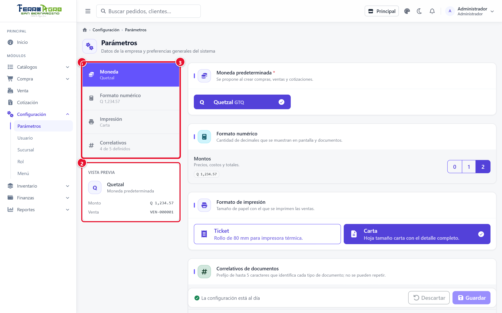
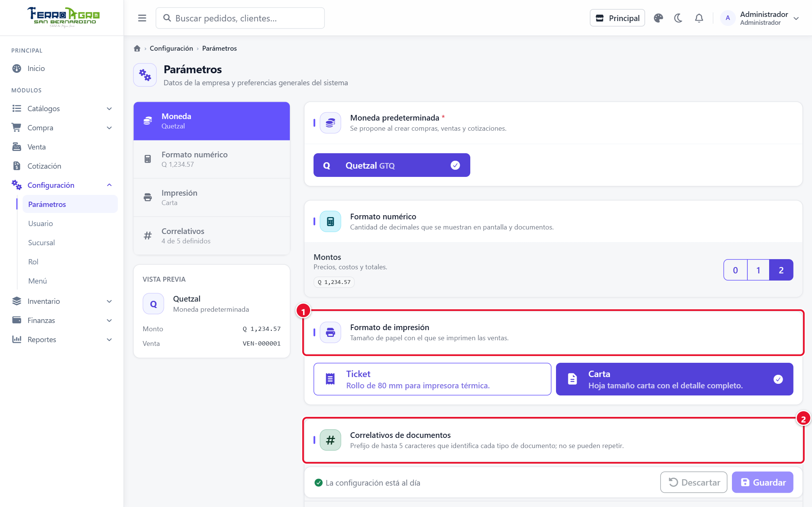
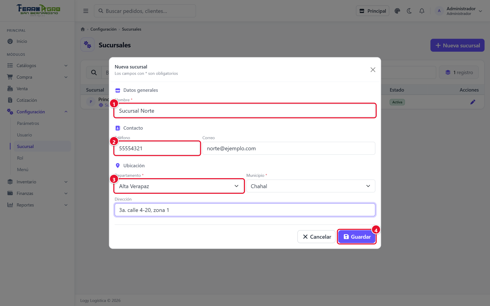
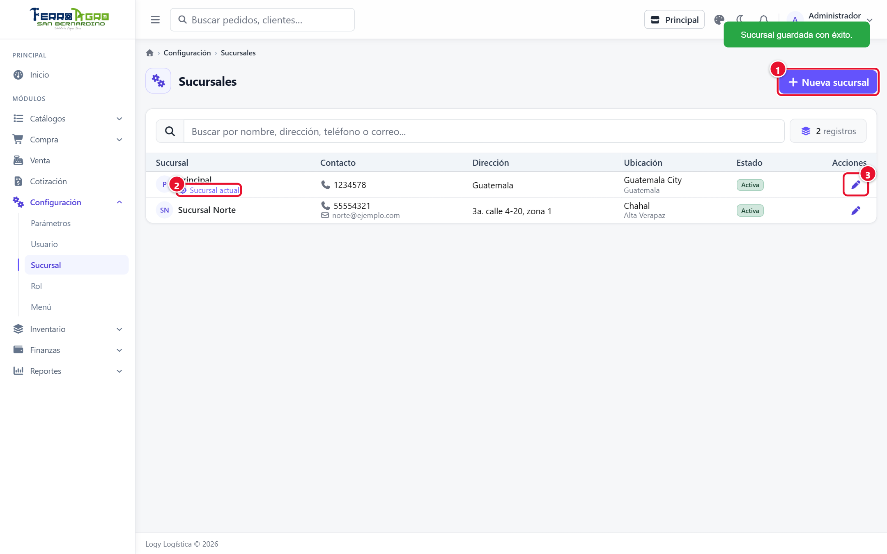
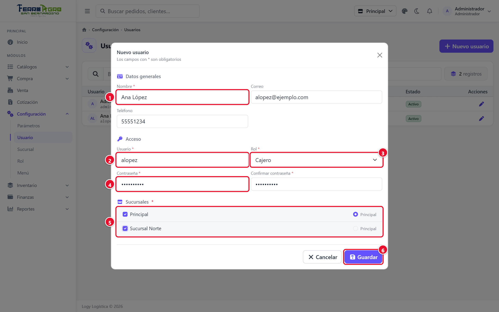
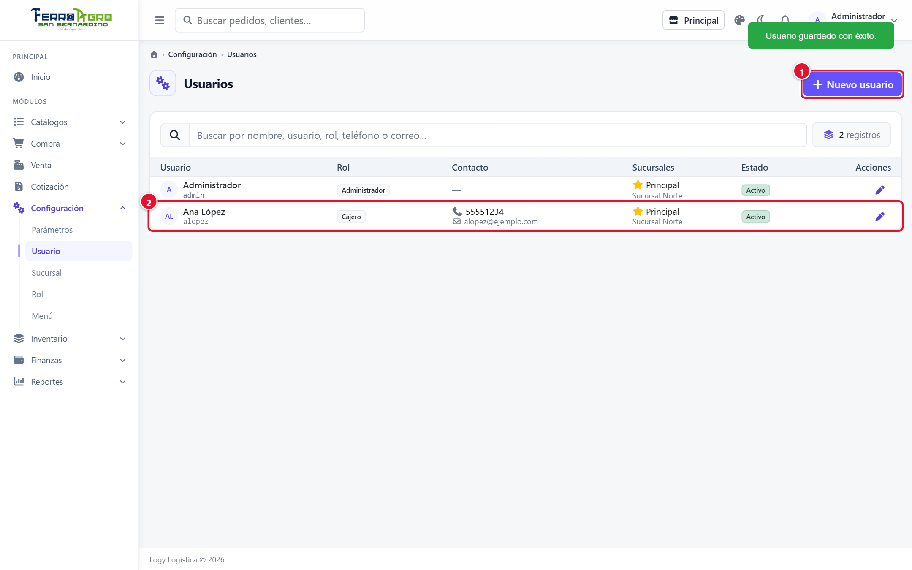
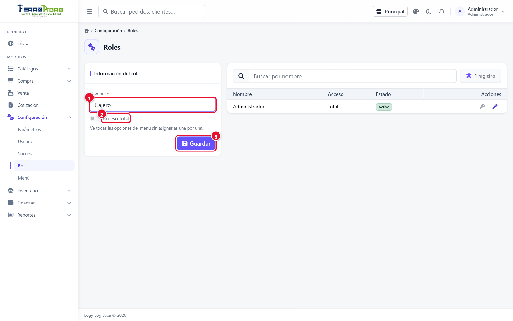
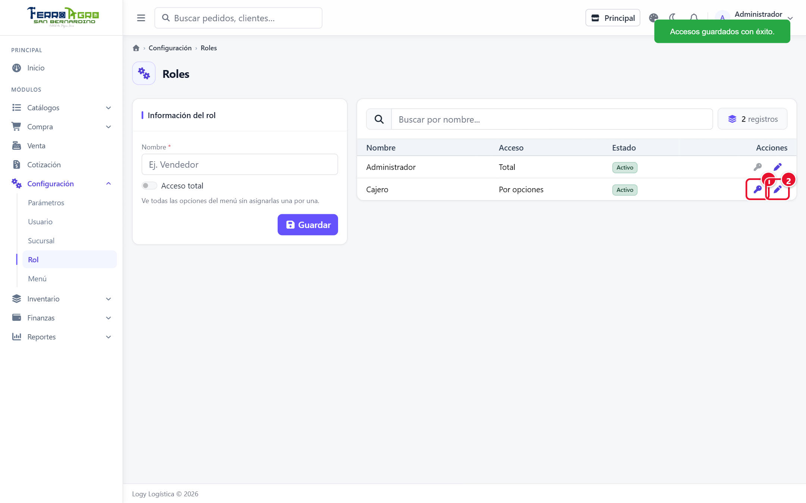
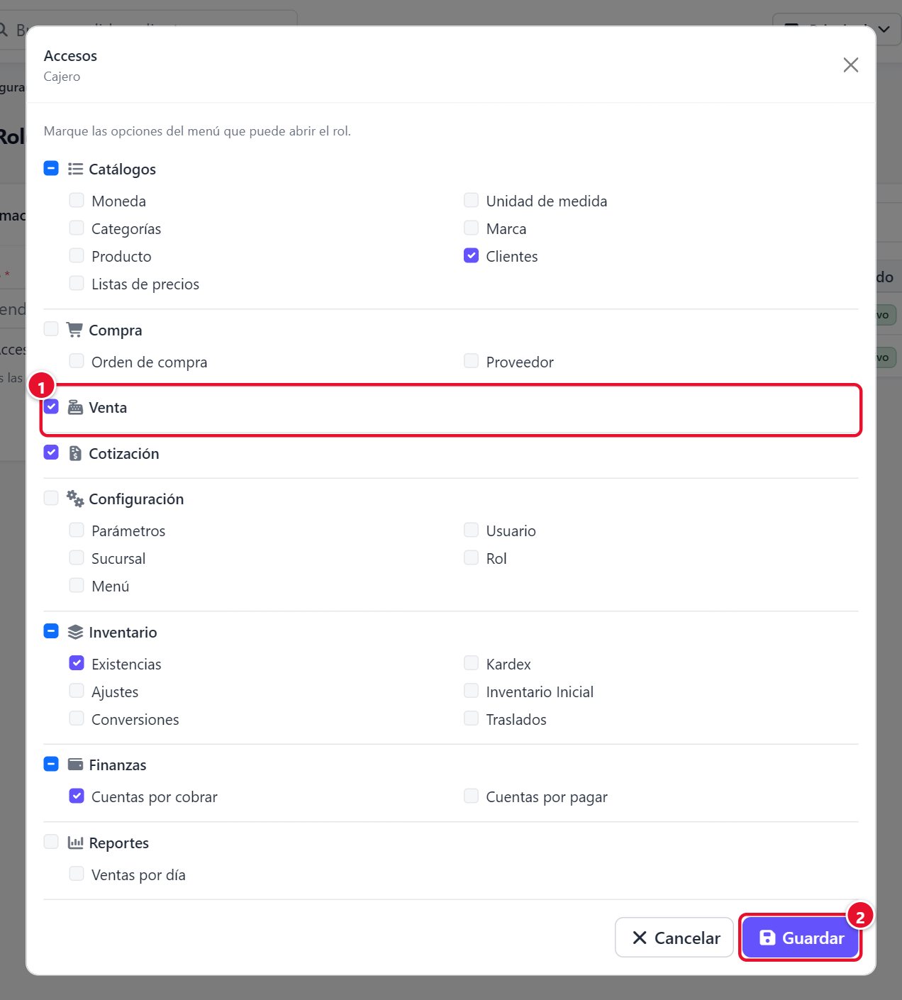
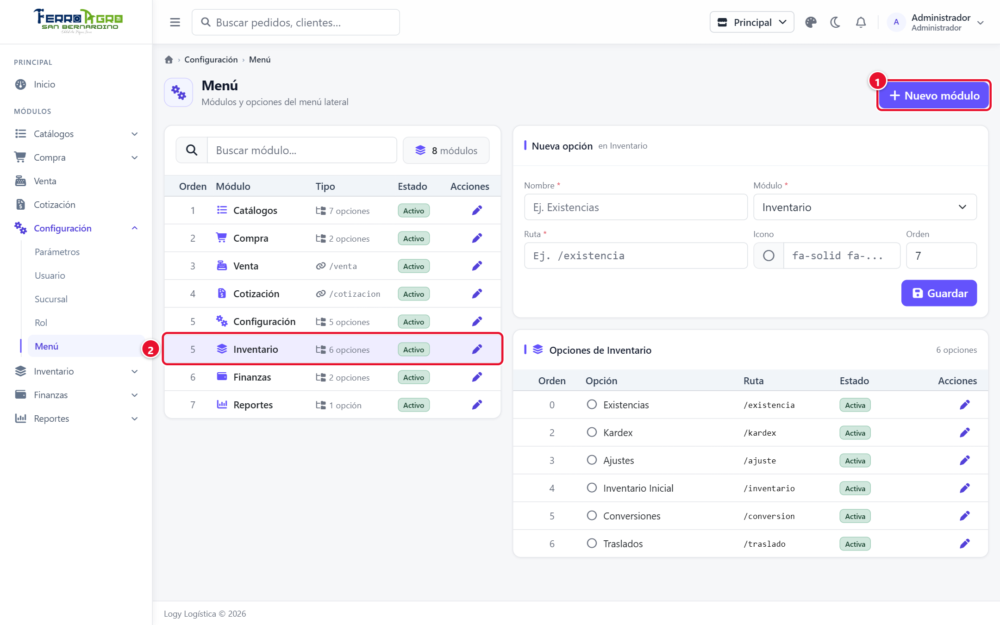

# 2 · Configuración

[← Índice](README.md)

Menú **Configuración**. Normalmente solo lo usa un administrador.

## Parámetros

**Configuración › Parámetros**. Ajustes generales de la empresa. A la izquierda hay un índice de secciones con un resumen de lo configurado y una **Vista previa** de cómo se verán los montos y los correlativos.

| Sección | Qué se configura |
|---|---|
| **Moneda** | **Moneda predeterminada** de la empresa. Su símbolo aparece en pantallas, PDF y Excel, y se propone al crear compras, ventas y cotizaciones. Si no aparece ninguna, primero registre monedas activas en **Catálogos › Moneda**. |
| **Formato numérico** | Decimales de los **Montos** (precios, costos y totales): 0, 1 o 2. Sin definir, se usan 2. Las cantidades de producto no dependen de este ajuste. |
| **Impresión** | **Formato de impresión** de las ventas: **Ticket** (rollo de 80 mm para impresora térmica) o **Carta** (hoja tamaño carta con el detalle completo). Solo cambia la venta; la cotización y la orden de compra siempre salen en carta. |
| **Correlativos** | Prefijo de hasta 5 caracteres para el código de los productos nuevos (ej. `PRD` → `PRD-000001`) y de las órdenes de compra (ej. `COM`). No se pueden repetir. |

<!-- figura -->

- **①** Índice de secciones con el resumen de lo configurado.
- **②** **Vista previa** de montos y correlativos.
- **③** Sección activa (Moneda).

<!-- /figura -->

<!-- figura -->

- **①** **Formato de impresión**: Ticket o Carta.
- **②** **Correlativos de documentos**: prefijos de producto y compra.

<!-- /figura -->

Cuando hay cambios sin guardar, la barra inferior dice **Tiene cambios sin guardar**: pulse **Guardar** o **Descartar**. Los cambios aplican de inmediato.

> El número de las ventas y de las cotizaciones sale de su **serie** (ej. `FAC-000000001`, `COT-000000001`), no de estos prefijos.

## Sucursal

**Configuración › Sucursal**. Las sucursales son los lugares donde se vende y se guarda mercadería. Cada una tiene su propia existencia.

1. Pulse **Nueva sucursal**.
2. Llene **Datos generales** (**Nombre**), **Contacto** (**Teléfono**, **Correo**) y **Ubicación** (**Departamento**, **Municipio**, **Dirección**).
3. Pulse **Guardar**.

<!-- figura -->

- **①** **Nombre** de la sucursal.
- **②** **Teléfono** y correo.
- **③** **Departamento**, municipio y dirección.
- **④** **Guardar**.

<!-- /figura -->

- La sucursal en la que está trabajando se marca como **Sucursal actual**.
- Para que un usuario trabaje en una sucursal, hay que asignársela en su ficha de usuario.
- Para dejar de usar una sucursal, quite la marca **Activa**. No puede desactivar la sucursal en la que está trabajando.

<!-- figura -->

- **①** **Nueva sucursal**.
- **②** Marca de la **Sucursal actual** (en la que usted trabaja).
- **③** Lápiz para editar.

<!-- /figura -->

## Usuario

**Configuración › Usuario**. Las personas que entran al sistema.

1. Pulse **Nuevo usuario**.
2. **Datos generales**: **Nombre**, **Teléfono** y **Correo**.
3. **Acceso**:
   - **Usuario**: el nombre con el que entra (ej. `alopez`). No se puede repetir.
   - **Contraseña** (mínimo 6 caracteres) y su confirmación. Al editar un usuario, déjela en blanco para no cambiarla.
   - **Rol**: define qué opciones del menú ve.
4. **Sucursales**: marque las sucursales donde puede trabajar y elija una como **Principal** (con esa inicia sesión).
5. Pulse **Guardar**.

<!-- figura -->

- **①** **Nombre** de la persona.
- **②** **Usuario** con el que entra al sistema.
- **③** **Rol**.
- **④** **Contraseña** y su confirmación.
- **⑤** **Sucursales** asignadas y la **Principal**.
- **⑥** **Guardar**.

<!-- /figura -->

- Para impedir que alguien entre, quite la marca **Activo**. No puede desactivar su propio usuario.
- Si un usuario olvidó su contraseña, edítelo y escriba una nueva.

<!-- figura -->

- **①** **Nuevo usuario**.
- **②** Usuario creado, con su rol y sucursales (la estrella indica la principal).

<!-- /figura -->

## Roles y accesos

**Configuración › Rol**. Un rol agrupa los permisos de un tipo de usuario (Administrador, Cajero, Bodega…).

### Crear un rol

1. Escriba el **Nombre** (ej. *Vendedor*).
2. **Acceso total**: márquelo solo para administradores. Un rol con acceso total ve **todas** las opciones del menú y **los documentos de todos** los usuarios.
3. Pulse **Guardar**.

<!-- figura -->

- **①** **Nombre** del rol.
- **②** **Acceso total** (solo para administradores).
- **③** **Guardar**.

<!-- /figura -->

### Asignar accesos

Un rol nuevo empieza **sin accesos**.

1. En la fila del rol, pulse el botón de la llave (**Accesos**).
2. Marque las opciones del menú que puede abrir el rol.
3. Pulse **Guardar**.

<!-- figura -->

- **①** Llave: abre los **Accesos** del rol.
- **②** Lápiz: edita el rol.

<!-- /figura -->

<!-- figura -->

- **①** Opciones marcadas: el rol las ve en el menú (aquí Venta, Cotización, Clientes, Existencias y Cuentas por cobrar).
- **②** **Guardar**.

<!-- /figura -->

### Qué ve un usuario que no es administrador

- Solo las opciones del menú que su rol tiene marcadas.
- En ventas, cotizaciones, compras, ajustes, conversiones y traslados enviados: **solo los documentos que él registró**.
- Cuentas por cobrar, cuentas por pagar, inventario inicial, el dashboard y los traslados que llegan a su sucursal los ven **todos** los usuarios de la sucursal.

> No se puede desactivar ni quitarle el acceso total al rol con el que usted está trabajando, para que nadie se quede sin poder entrar a Configuración.

## Menú

**Configuración › Menú**. Organiza las opciones del menú lateral. **Se usa poco**: normalmente solo cuando se agrega una pantalla nueva al sistema.

- **Nuevo módulo**: un grupo del menú. **Tipo**: **Agrupa opciones** (se despliega y muestra sus opciones) o **Enlace directo** (lleva directo a una pantalla). Lleva **Nombre**, **Icono** (Font Awesome), **Ruta** (solo si es enlace directo) y **Orden**.
- **Nueva opción**: una pantalla dentro de un módulo. Lleva **Módulo**, **Nombre**, **Icono**, **Ruta** (ej. `/existencia`) y **Orden**.
- Si una opción apunta a una ruta que todavía no tiene pantalla, aparece la marca **Sin pantalla** y el menú lleva al inicio.

<!-- figura -->

- **①** **Nuevo módulo**.
- **②** Módulo seleccionado (Inventario); sus opciones aparecen a la derecha.
- **③** Formulario de la opción (**Nueva opción**).

<!-- /figura -->

> **Importante**: no cambie la **Ruta** de las opciones existentes; si lo hace, el menú deja de abrir la pantalla.
