# 3 · Catálogos

[← Índice](README.md)

Menú **Catálogos**. Son los datos base que usan las ventas, compras e inventario. En todos los catálogos:

- se crea llenando el formulario y pulsando **Guardar**;
- se edita con el lápiz (**Editar**) de la fila;
- no se borra: se desactiva quitando la marca **Activo / Activa**. Lo inactivo deja de aparecer en los selectores, pero los documentos que ya lo usaron lo conservan.

## Moneda

**Catálogos › Moneda**. Monedas con las que trabaja la empresa.

- **Código** (ej. `GTQ`), **Nombre** (ej. *Quetzal*) y **Símbolo** (ej. `Q`).
- La moneda de la empresa se elige en [Parámetros](02-configuracion.md#parámetros).

<!-- figura -->

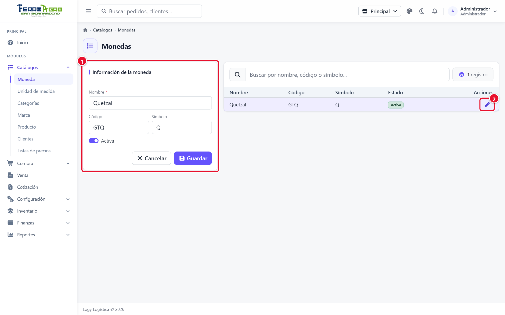

- **①** Formulario: código, nombre, símbolo y **Activa**.
- **②** Lápiz para editar una moneda de la lista.

<!-- /figura -->

## Unidad de medida

**Catálogos › Unidad de medida**. Cómo se cuentan los productos: Unidad, Libra, Quintal, Galón, Docena…

- **Código** (ej. `UN`) y **Nombre** (ej. *Unidad*).
- La instalación ya trae las unidades más comunes y sus equivalencias.

### Equivalencias

Una equivalencia dice cuántas unidades pequeñas caben en una grande, por ejemplo **1 Quintal = 100 Libra**. Sirven para que un producto se pueda vender o comprar en otra unidad (ver [Presentaciones](#presentaciones)).

1. Haga clic en la unidad (lápiz **Editar**). Debajo del formulario aparece **Equivalencias de …**.
2. Elija la **Unidad grande**, escriba la **Cantidad** (mayor que 1) y elija la **Unidad pequeña**. El botón de flechas (**Cambiar de lado**) intercambia la unidad grande y la pequeña.
3. Pulse **Agregar**.

<!-- figura -->

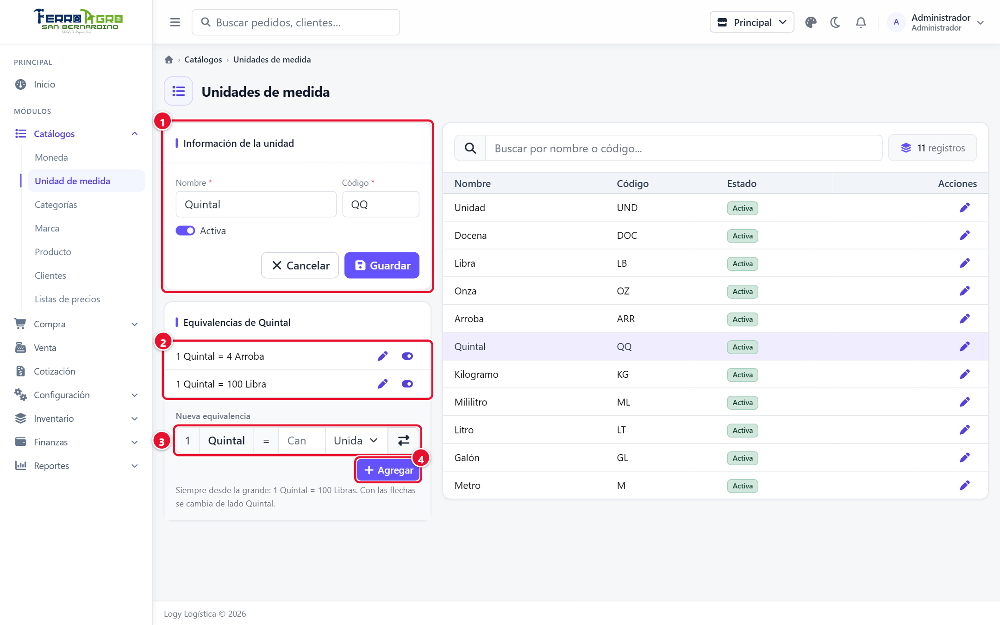

- **①** Datos de la unidad.
- **②** Equivalencias registradas (1 Quintal = 4 Arroba, 1 Quintal = 100 Libra).
- **③** Nueva equivalencia: unidad grande, cantidad y unidad pequeña (las flechas cambian el lado).
- **④** **Agregar**.

<!-- /figura -->

- Cada par de unidades tiene una sola equivalencia.
- Si algún producto ya usa una equivalencia como presentación, ya no se puede cambiar la cantidad: solo activarla o desactivarla con el interruptor.

## Categorías

**Catálogos › Categorías**. Agrupan los productos (Bebidas, Herramientas…). Se usan como filtro en el punto de venta, existencias y catálogos de productos.

- **Nombre** y **Color de la etiqueta** (el color con que se ve la categoría en las listas).

<!-- figura -->

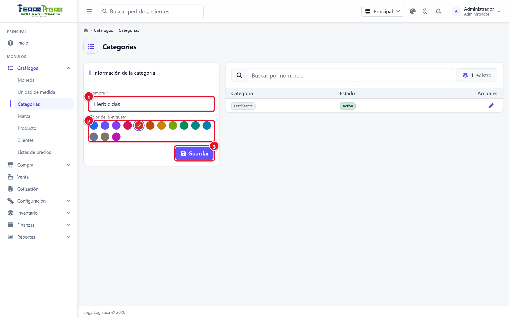

- **①** **Nombre**.
- **②** **Color de la etiqueta**.
- **③** **Guardar**.

<!-- /figura -->

## Marca

**Catálogos › Marca**. Solo **Nombre** (ej. *Samsung*).

<!-- figura -->

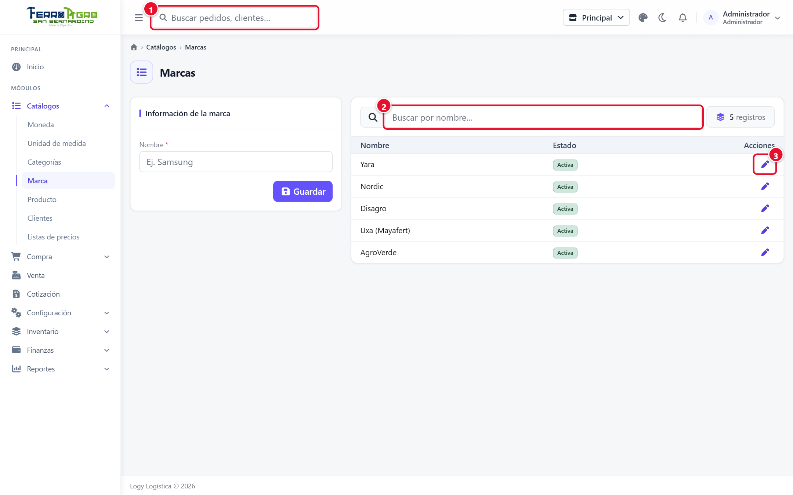

- **①** Formulario de la marca.
- **②** Buscador.
- **③** Lápiz para editar.

<!-- /figura -->

## Producto

**Catálogos › Producto**. La lista muestra los productos con su categoría, marca, unidad, costo, precio y estado. Se filtra por texto (nombre, código o código de barras) y por categoría.

<!-- figura -->

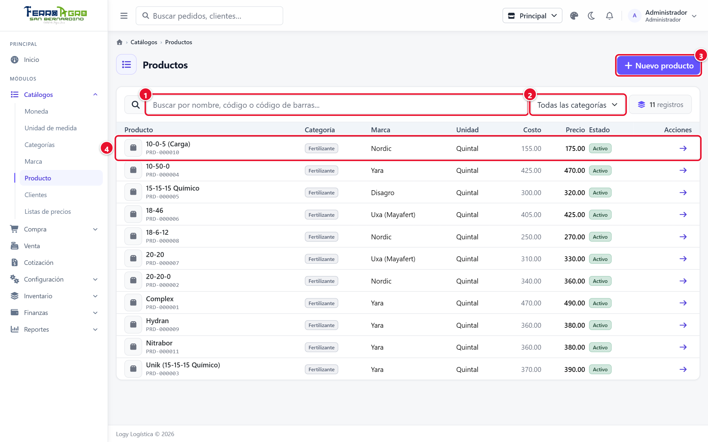

- **①** Buscador (nombre, código o código de barras).
- **②** Filtro por categoría.
- **③** **Nuevo producto**.
- **④** Clic en una fila para abrir la ficha.

<!-- /figura -->

### Crear o editar un producto

1. Pulse **Nuevo producto** (o haga clic en un producto para abrir su ficha).
2. Llene la ficha. Los datos están en la pestaña **General**, por secciones; en los bienes también aparece la pestaña **Presentaciones**.

| Sección | Campos |
|---|---|
| **Datos generales** | **Nombre** *. **Tipo**: **Bien** (maneja existencia) o **Servicio** (no maneja existencia ni vencimiento). **Código**: se genera al guardar (ej. `PRD-000001`) y no cambia. **Código de barras**: escanéelo o escríbalo; no se puede repetir. **Categoría** *, **Marca** * y **Unidad de medida** *. |
| **Precios e inventario** | **Costo**, **Precio de venta**, **Existencia mínima** (bajo este número el producto aparece como "bajo el mínimo") y **Controlar fecha de vencimiento** (si se marca, las compras, ajustes e inventario piden la fecha de vencimiento de cada lote). Solo al crear un bien: **Existencia inicial** (opcional; entra en la sucursal de trabajo, en la unidad de medida y con el costo indicado; al guardar se crea un ajuste "Inventario inicial" que se ve en Ajustes y Kardex) y su **Fecha de vencimiento** si se controla. Los servicios solo muestran los precios. |
| **Descripción** | Texto con formato (negritas, listas…): características, usos, medidas. |
| **Tarjeta del producto** (a la derecha) | La **foto** (arrastre una imagen al cuadro o haga clic en él; **Quitar** la retira; se sube cuando pulsa **Guardar**), el nombre, el estado, el código, la categoría, la marca y la unidad, y cuatro datos: **Precio**, **Costo**, **Margen** y **Ganancia** (en rojo si el precio es menor al costo). Debajo, al editar un bien, está la tarjeta **Existencias** de su sucursal. |
| **Pie** | El interruptor **Activo** y los botones **Cancelar** y **Guardar**, siempre a la vista. **Guardar** guarda todas las pestañas. Si guarda desde otra pestaña y falta un dato obligatorio, vuelve a **General** y se marca el campo. |

3. Pulse **Guardar**. **Volver a productos** regresa a la lista.

<!-- figura -->

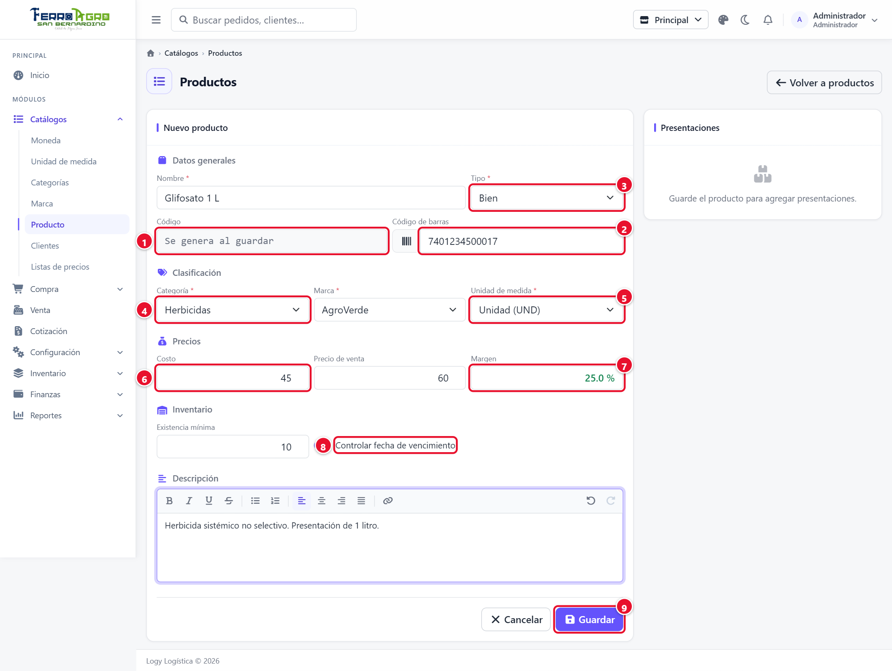

- **①** **Código**: se genera al guardar.
- **②** **Código de barras**.
- **③** **Tipo**: Bien o Servicio.
- **④** **Categoría** y marca.
- **⑤** **Unidad de medida**.
- **⑥** **Costo** y precio de venta.
- **⑦** **Margen** (se calcula solo).
- **⑧** **Controlar fecha de vencimiento**.
- **⑨** **Guardar**.

<!-- /figura -->

- El **costo** se actualiza solo cada vez que se **recibe una compra** del producto (toma el último costo, por unidad).
- La **unidad de medida** no se puede cambiar si el producto tiene existencia en alguna sucursal. Primero hay que sacarla con un ajuste de salida.
- Debajo de la foto, al editar un bien, se ven las **Existencias** del producto en la sucursal de trabajo (por presentación y fecha de vencimiento).

### Presentaciones

Una presentación es otra forma de vender o comprar el mismo producto. Se agregan en la ficha del producto, en el bloque **Presentaciones** (primero hay que guardar el producto). La primera fila siempre es la unidad de medida del producto, marcada como **Base**.

Hay dos tipos:

| Tipo | Cuándo se usa | Cómo se captura |
|---|---|---|
| **Otra unidad** | El producto se cuenta en una unidad y también se vende en otra que tiene equivalencia. Ej.: arroz por **Quintal** que también se vende por **Libra**. | Elija la unidad de la lista. Solo aparecen las que tienen equivalencia activa con la unidad del producto; si no hay, regístrelas en [Unidades de medida](#equivalencias). |
| **Empaque** | Un paquete propio del producto. Ej.: **Caja 12**, **Fardo 24**. | Escriba el nombre (ej. *Caja 12*) y cuántas unidades **Contiene** (más de 1). |

Pulse **Agregar**. La columna **Equivalencia** muestra la igualdad (ej. *1 Caja 12 = 12 UN*).

<!-- figura -->

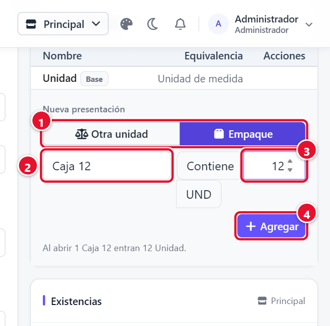

- **①** Tipo: **Empaque**.
- **②** Nombre del empaque (ej. *Caja 12*).
- **③** Unidades que **Contiene**.
- **④** **Agregar**.

<!-- /figura -->

<!-- figura -->

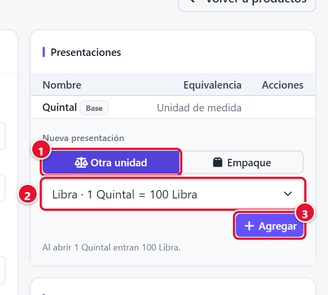

- **①** Tipo: **Otra unidad**.
- **②** Unidad con equivalencia (ej. *Libra, 1 Quintal = 100 Libra*).
- **③** **Agregar**.

<!-- /figura -->

<!-- figura -->

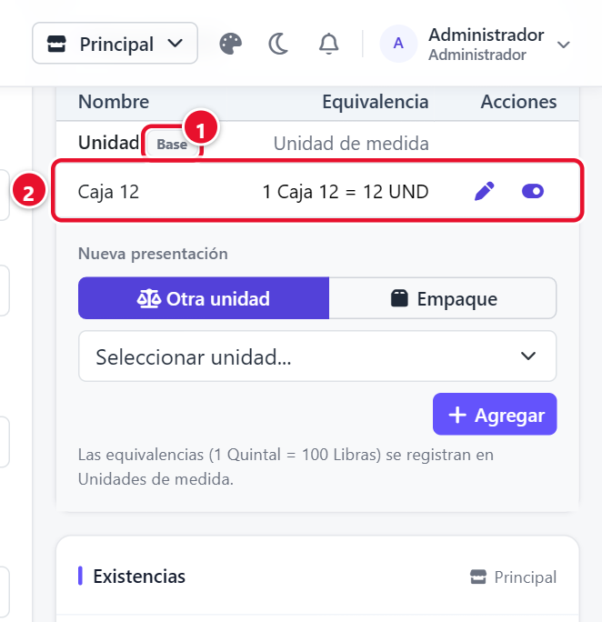

- **①** La unidad de medida es la **Base**.
- **②** Presentación creada con su equivalencia; lápiz para editar e interruptor para activar o desactivar.

<!-- /figura -->

- **Precio y costo** de una presentación = los del producto × lo que contiene. Una caja de 12 cuesta 12 veces el precio unitario (para darle otro precio use una [lista de precios](#listas-de-precios)).
- **Cada presentación tiene su propia existencia**. Si compra 5 cajas, tiene 5 cajas; para vender unidades sueltas hay que **abrir** una caja con una [conversión](06-inventario.md#conversiones) (también desde el punto de venta con el botón **Abrir**).
- Una presentación de tipo **Otra unidad** no se edita; solo se activa o desactiva. Un **Empaque** se edita con el lápiz, pero si ya tiene movimientos (compras, ventas…) no se puede cambiar lo que contiene: desactívelo y cree otro.
- Una unidad más pequeña que la del producto solo se ofrece si cabe un número exacto de veces (ej. 100 libras en un quintal).

<!-- figura -->

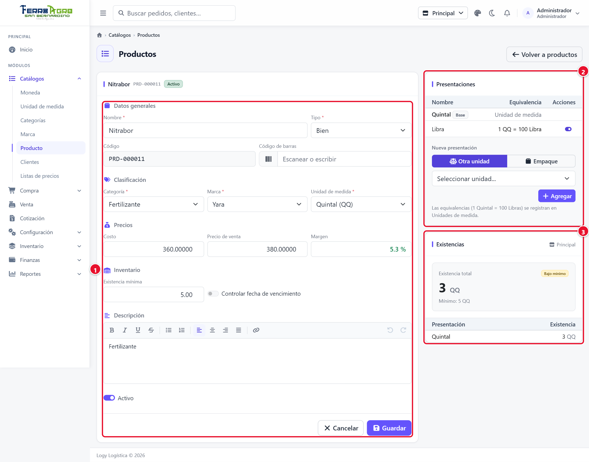

- **①** Datos del producto.
- **②** **Presentaciones** (aquí, Libra).
- **③** **Existencias** en la sucursal de trabajo.

<!-- /figura -->

## Clientes

**Catálogos › Clientes**. El formulario se abre en una ventana con varias secciones:

| Sección | Campos |
|---|---|
| **Datos generales** | **Código** (ej. *CLI001*), **Nombre**, **Razón social** (nombre para facturación), **NIT / Identificación** (ej. *1234567-8* o *CF*), **Activo**. |
| **Contacto** | **Teléfono** y **Correo**. |
| **Ubicación** | **Departamento**, **Municipio** y **Dirección**. |
| **Crédito** | **Otorgar crédito**, **Límite de crédito** (0 = sin límite) y **Días de crédito** (plazo para pagar). |
| **Precios** | **Lista de precios** del cliente o **Precio general**. Lo que no está en la lista se le cobra al precio general. |

<!-- figura -->

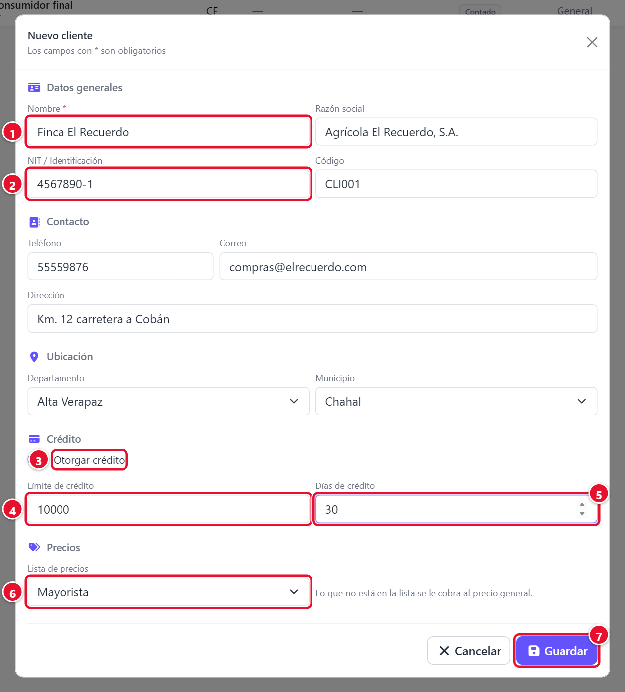

- **①** **Nombre**.
- **②** **NIT / Identificación**.
- **③** **Otorgar crédito**.
- **④** **Límite de crédito**.
- **⑤** **Días de crédito**.
- **⑥** **Lista de precios**.
- **⑦** **Guardar**.

<!-- /figura -->

- El cliente **Consumidor final (CF)** lo crea la instalación. Es el que se usa cuando una venta no lleva cliente. **Nunca compra al crédito.**
- Un cliente solo puede comprar al crédito si tiene **Otorgar crédito** marcado. Si tiene límite, el sistema no deja vender al crédito más de lo que le queda disponible (límite − saldo pendiente).
- También se puede crear un cliente desde el punto de venta y desde la cotización (**Nuevo cliente**); ahí no se asigna la lista de precios.

<!-- figura -->

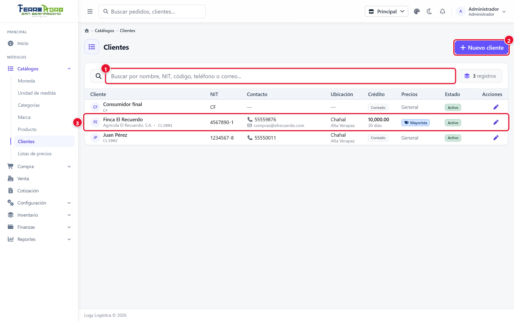

- **①** Buscador.
- **②** **Nuevo cliente**.
- **③** Cliente con crédito y lista Mayorista.

<!-- /figura -->

## Listas de precios

**Catálogos › Listas de precios**. Precios especiales para grupos de clientes (ej. *Mayorista*). Cada lista tiene un precio fijo por producto o por presentación.

### Crear la lista

1. Escriba el **Nombre** (ej. *Mayorista*) y la **Descripción**.
2. Pulse **Guardar**.

<!-- figura -->

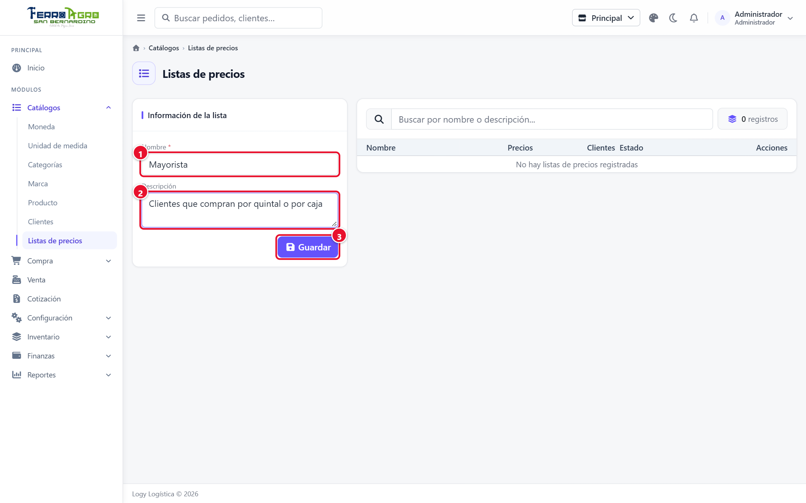

- **①** **Nombre**.
- **②** **Descripción**.
- **③** **Guardar**.

<!-- /figura -->

La tabla muestra cuántos **Precios** tiene cada lista y cuántos **Clientes** la usan. Con la lista inactiva, sus clientes compran al precio general.

<!-- figura -->

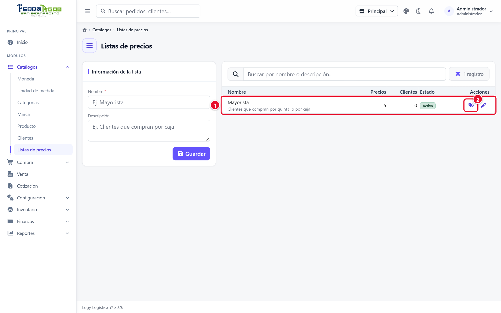

- **①** Lista con su número de precios y de clientes.
- **②** Botón **Precios** (etiquetas).

<!-- /figura -->

### Cargar los precios

1. En la fila de la lista, pulse **Precios** (ícono de etiquetas).
2. Aparece una fila por producto en su unidad y otra por cada presentación, con **Costo**, **Precio general**, **Precio de lista** y **Margen**.
3. Escriba el **Precio de lista** de los artículos que quiera incluir. **Vacío = no está en la lista** (el cliente paga el precio general).
4. Atajos:
   - Filtre por texto, categoría o marque **Solo los de la lista**.
   - **Llenar los vacíos con el precio general menos X %** y **Llenar**: pone ese precio en todos los vacíos que se ven.
   - El botón de quitar de cada fila borra el precio de lista de ese artículo.
5. Pulse **Guardar** (o **Descartar** para deshacer los cambios).

<!-- figura -->

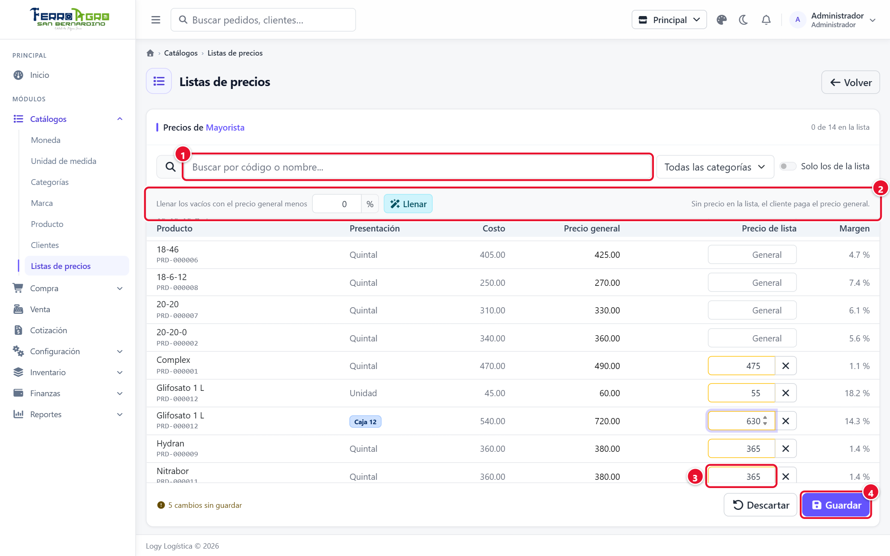

- **①** Buscador y filtros.
- **②** **Llenar los vacíos con el precio general menos X %**.
- **③** **Precio de lista** de un artículo (vacío = precio general).
- **④** **Guardar**.

<!-- /figura -->

- No se puede guardar un precio de lista **menor al costo** (la fila se marca *Menor al costo*) ni igual a 0.
- Si pulsa **Volver** con cambios sin guardar, el sistema pide confirmación.

### Asignar la lista a un cliente

En **Catálogos › Clientes**, sección **Precios**, elija la lista. Al venderle o cotizarle, el sistema propone esa lista; el vendedor la puede cambiar (ver [Ventas](05-ventas.md#lista-de-precios)).
