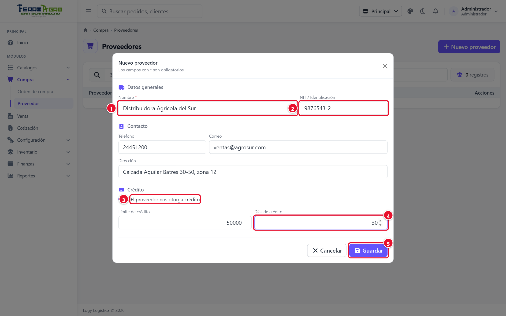
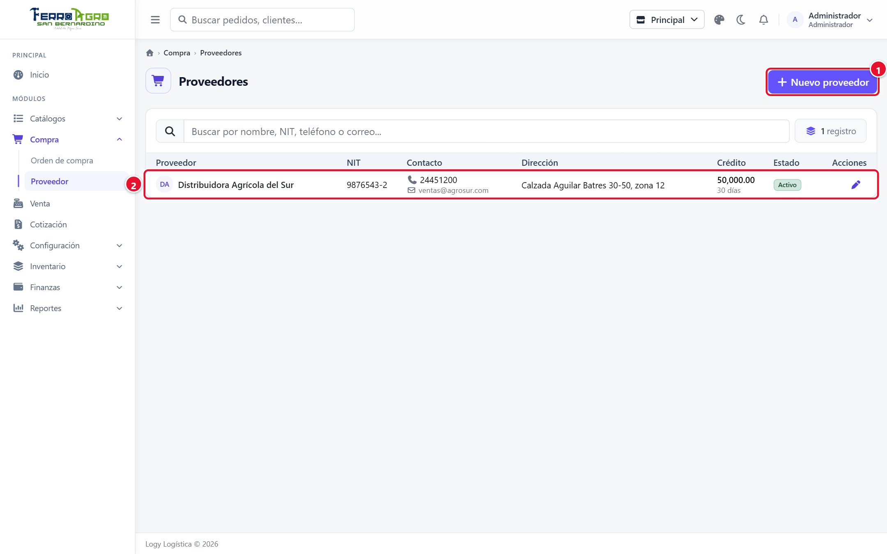
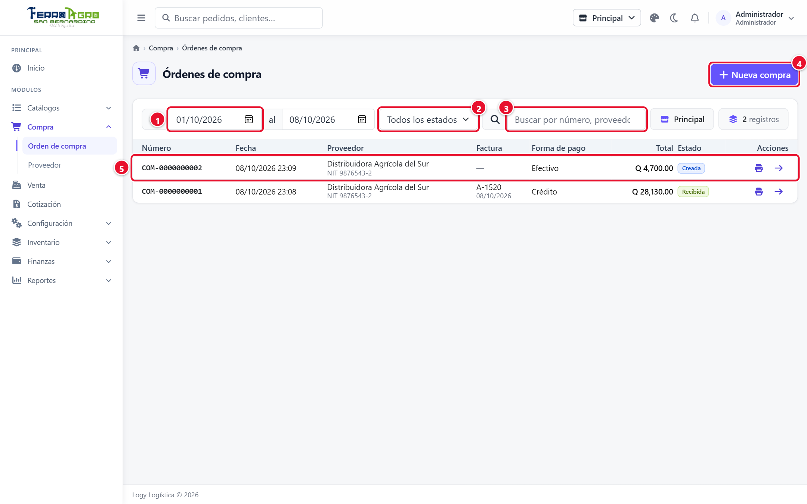
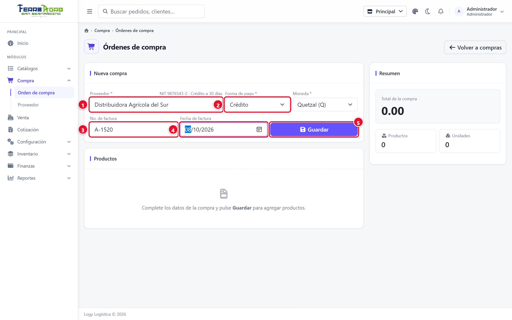
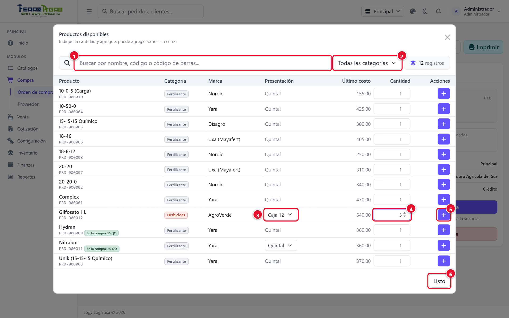
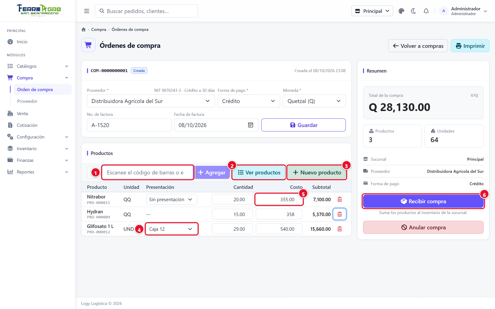
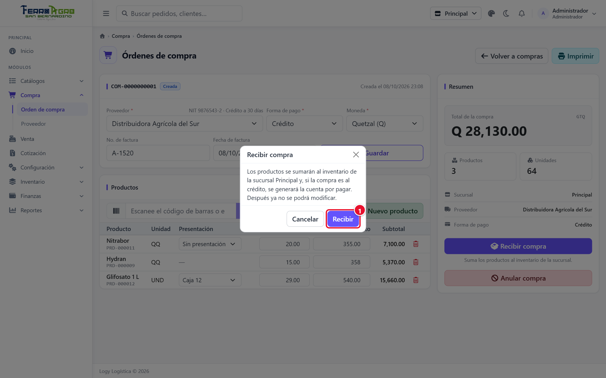
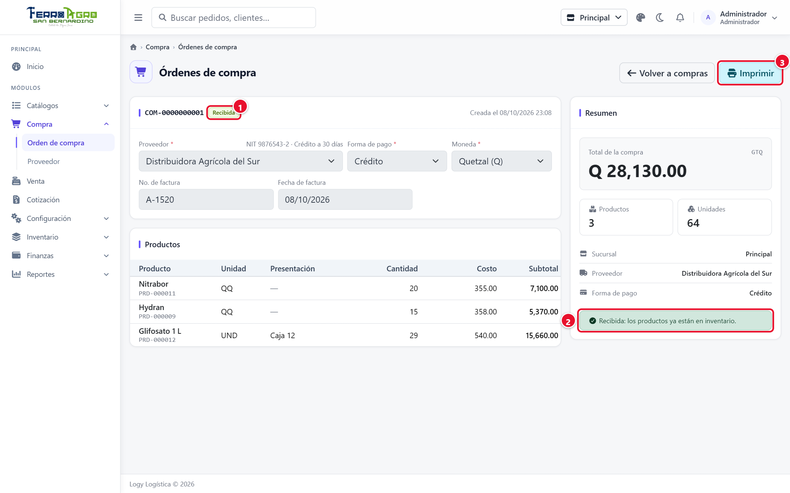
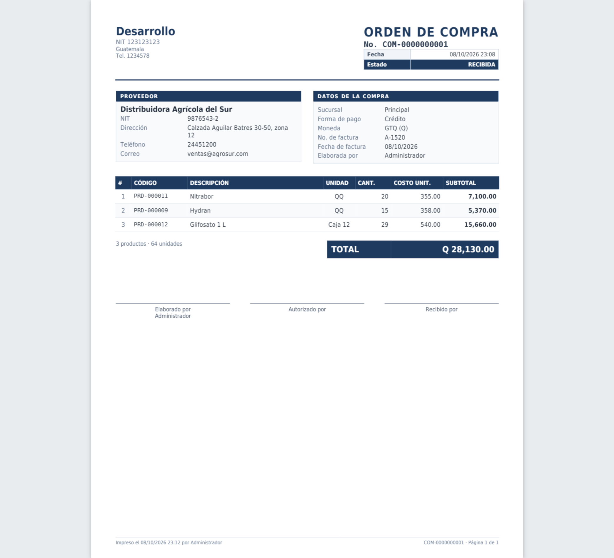

# 4 · Compras

[← Índice](README.md)

Menú **Compra**. Se registran los proveedores y las órdenes de compra. Al **recibir** una orden, la mercadería entra al inventario y, si la compra es al crédito, se crea la cuenta por pagar.

## Proveedor

**Compra › Proveedor**. Pulse **Nuevo proveedor**; el formulario tiene tres secciones:

| Sección | Campos |
|---|---|
| **Datos generales** | **Nombre** (ej. *Distribuidora El Sol*), **NIT / Identificación**, **Activo**. |
| **Contacto** | **Teléfono**, **Correo** y **Dirección**. |
| **Crédito** | **El proveedor nos otorga crédito**, **Límite de crédito** y **Días de crédito**. Los días definen cuándo vence la cuenta por pagar de cada compra al crédito. |

<!-- figura -->

- **①** **Nombre**.
- **②** **NIT / Identificación**.
- **③** **El proveedor nos otorga crédito**.
- **④** **Días de crédito**.
- **⑤** **Guardar**.

<!-- /figura -->

La lista indica si el proveedor es de **Contado** o **Crédito**.

<!-- figura -->

- **①** **Nuevo proveedor**.
- **②** Proveedor de crédito con su límite y días.

<!-- /figura -->

## Orden de compra

**Compra › Orden de compra**. La lista muestra las órdenes **de la sucursal de trabajo**, con filtros por fechas (**Desde / Hasta**), **Estado** y buscador (número, proveedor o factura).

<!-- figura -->

- **①** Fechas **Desde / Hasta**.
- **②** **Estado**.
- **③** Buscador.
- **④** **Nueva compra**.
- **⑤** Orden de compra (clic para abrirla).

<!-- /figura -->

### Estados

| Estado | Significado |
|---|---|
| **Creada** | Se está armando. Se puede editar, recibir o anular. |
| **Recibida** | La mercadería ya entró al inventario. Ya no se edita ni se anula. |
| **Anulada** | Se canceló antes de recibirla. No movió inventario. |

### Registrar una compra

1. Pulse **Nueva compra**.
2. **Encabezado** (a la izquierda):
   - **Proveedor**.
   - **Forma de pago**: si es **Crédito**, al recibir se crea la cuenta por pagar.
   - **Moneda**.
   - **No. de factura** (serie y número) y **Fecha de factura**. Son **obligatorios para recibir una compra al crédito**.
   - Pulse **Guardar**. La compra recibe su número (ej. `COM-0000000008`).
<!-- figura -->

- **①** **Proveedor**.
- **②** **Forma de pago**.
- **③** **No. de factura**.
- **④** **Fecha de factura**.
- **⑤** **Guardar**.

<!-- /figura -->

3. **Productos** (a la derecha):
   - Escanee o escriba el **código o código de barras** y pulse Enter: se agrega con cantidad 1 y el último costo. Si ya estaba, suma 1.
   - O pulse **Ver productos**, busque por nombre o categoría, indique la cantidad y pulse **Agregar**. Al terminar, **Listo**.
   - Si el producto no existe, pulse **Nuevo producto**: al guardarlo se agrega a la compra con cantidad 1.
<!-- figura -->

- **①** Buscador.
- **②** Filtro por categoría.
- **③** **Presentación** (aquí, Caja 12).
- **④** **Cantidad**.
- **⑤** Agregar (**+**).
- **⑥** **Listo**.

<!-- /figura -->

4. En cada línea revise:
   - **Presentación**: déjela en *Sin presentación* para comprar en la unidad del producto, o elija la caja, fardo, etc.
   - **Cantidad** (mayor que 0) y **Costo** (de una unidad de la presentación elegida; se muestra el **Último costo** como referencia).
   - La **X** quita la línea.

   > Por ahora la orden de compra no pide la fecha de vencimiento: lo recibido entra al lote "sin vencimiento". Para registrar mercadería con fecha de vencimiento use un [ajuste de entrada](06-inventario.md#ajustes) o el [inventario inicial](06-inventario.md#inventario-inicial).
5. El **Resumen** muestra productos, unidades y **Total de la compra**.

<!-- figura -->

- **①** Código o código de barras.
- **②** **Ver productos**.
- **③** **Nuevo producto**.
- **④** Presentación de la línea.
- **⑤** **Costo**.
- **⑥** **Recibir compra**.

<!-- /figura -->

### Recibir la compra

Cuando llega la mercadería y coincide con la orden:

1. Pulse **Recibir compra** y confirme con **Recibir**.
<!-- figura -->

- **①** **Recibir**.

<!-- /figura -->

2. El sistema:
   - suma los productos al inventario **de la sucursal de la orden**, en su presentación;
   - actualiza el **costo** de cada producto (costo de la línea ÷ lo que contiene la presentación);
   - si es al crédito, crea la **cuenta por pagar** con vencimiento = fecha de factura + días de crédito del proveedor ([Finanzas](07-finanzas.md#cuentas-por-pagar));
   - pasa la compra a **Recibida**.

<!-- figura -->

- **①** Estado **Recibida**.
- **②** Aviso: los productos ya están en inventario.
- **③** **Imprimir**.

<!-- /figura -->

> **Importante**: una compra recibida **no se puede anular**. Si hubo un error, corríjalo con un [ajuste de inventario](06-inventario.md#ajustes).

### Anular una compra

Solo una compra **Creada**. Pulse **Anular compra** y confirme. Queda anulada y ya no se puede modificar ni recibir.

### Imprimir

El botón **Imprimir** de la lista o del documento genera la orden de compra en PDF.

<!-- figura -->

<!-- /figura -->

## Preguntas comunes

- **¿Pagar la cuenta por pagar cambia el estado de la compra?** No. La compra queda como **Recibida**; el pago se ve en **Finanzas › Cuentas por pagar**.
- **¿Puedo recibir una compra en otra sucursal?** La mercadería entra siempre a la sucursal de la orden. Cree la orden estando en la sucursal que recibe, o use un [traslado](06-inventario.md#traslados).
