# 5 · Ventas

[← Índice](README.md)

Dos pantallas del menú: **Venta** (punto de venta) y **Cotización**.

---

## Punto de venta

Menú **Venta**. Todo lo que se vende sale de la existencia **de la sucursal de trabajo**, que aparece arriba a la derecha.

La pantalla tiene dos partes:

- **Productos** (izquierda): tarjetas de los productos con existencia, con buscador y filtro por categoría (**Todas** o una categoría). Cada **presentación** es una tarjeta aparte (ej. *Aceite 1 L* y *Aceite · Caja 12*), con su propia existencia y precio. Un producto sin existencia aparece como **Agotado** y no se puede agregar.
- **Venta actual** (derecha): las líneas que se están vendiendo, el cliente, la lista de precios, la serie, la forma de pago y el **Total a cobrar**.

<!-- figura -->

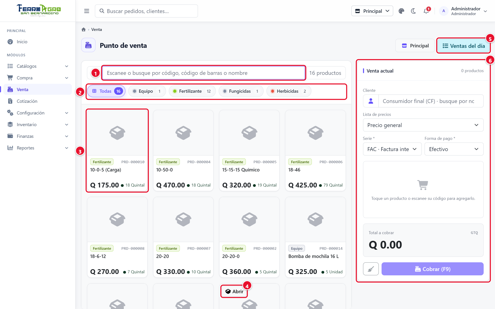

- **①** Buscador: escanee o escriba código, código de barras o nombre.
- **②** Filtro por categoría.
- **③** Tarjeta de un producto (clic para agregarlo).
- **④** **Abrir**: convierte una caja en unidades.
- **⑤** **Ventas del día**.
- **⑥** **Venta actual**.

<!-- /figura -->

### Hacer una venta

1. **Agregue los productos**:
   - escanee el código de barras o escriba el código y pulse Enter, o
   - busque por nombre en el buscador y haga clic en la tarjeta.

   Cada clic suma 1. En la venta actual puede cambiar la cantidad con **+** / **−** o escribiéndola, y quitar la línea con la papelera. El botón de la escoba (**Vaciar la venta actual**) borra todas las líneas.
2. **Cliente** (opcional): busque por nombre o NIT. Si no elige ninguno, la venta es para **Consumidor final (CF)**. Si el cliente no existe, escriba su nombre y use **Crear cliente «…»** / **Nuevo cliente**: al guardarlo queda como cliente de la venta. La **X** del cliente lo quita y vuelve a Consumidor final.
3. **Lista de precios**: ver [abajo](#lista-de-precios).
4. **Serie** y **Forma de pago** (Efectivo, Transferencia, Cheque o Crédito).
5. Pulse **Cobrar (F9)** o la tecla **F9**.

<!-- figura -->

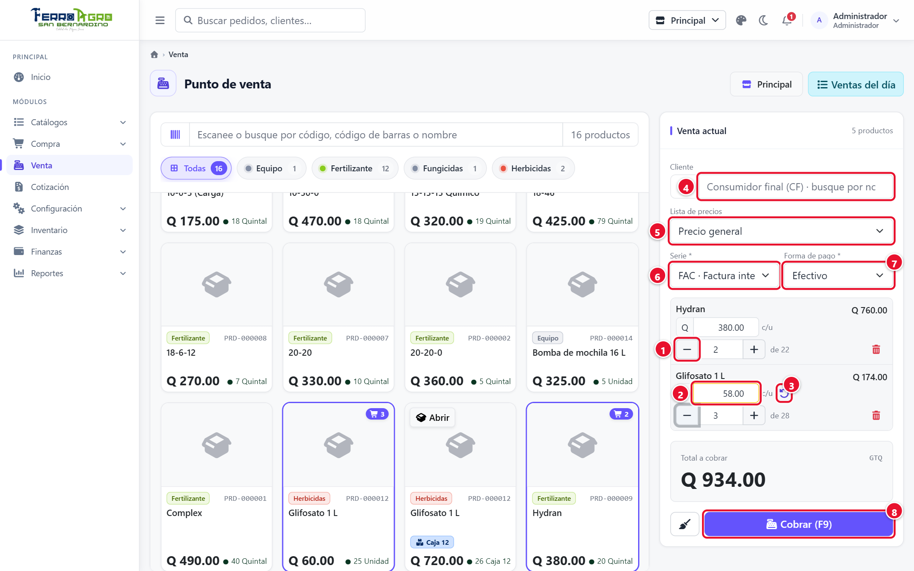

- **①** **−** / **+**: cambia la cantidad.
- **②** Precio de la línea (aquí se cambió a Q 58.00).
- **③** Volver al precio de venta.
- **④** **Cliente** (vacío = Consumidor final).
- **⑤** **Lista de precios**.
- **⑥** **Serie**.
- **⑦** **Forma de pago**.
- **⑧** **Cobrar (F9)**.

<!-- /figura -->

6. En la ventana **Cobrar venta**:
   - **Efectivo**: escriba el **Efectivo recibido** (o use los botones de montos rápidos) y el sistema calcula el **Vuelto**. Déjelo vacío si recibe el monto exacto.
   - **Transferencia / Cheque**: confirme que recibió el pago antes de registrar la venta.
   - **Crédito**: muestra el cliente, sus **Días de crédito** y su **Límite de crédito**; se generará la cuenta por cobrar.
7. Pulse **Cobrar** (o **Registrar a crédito**).

<!-- figura -->

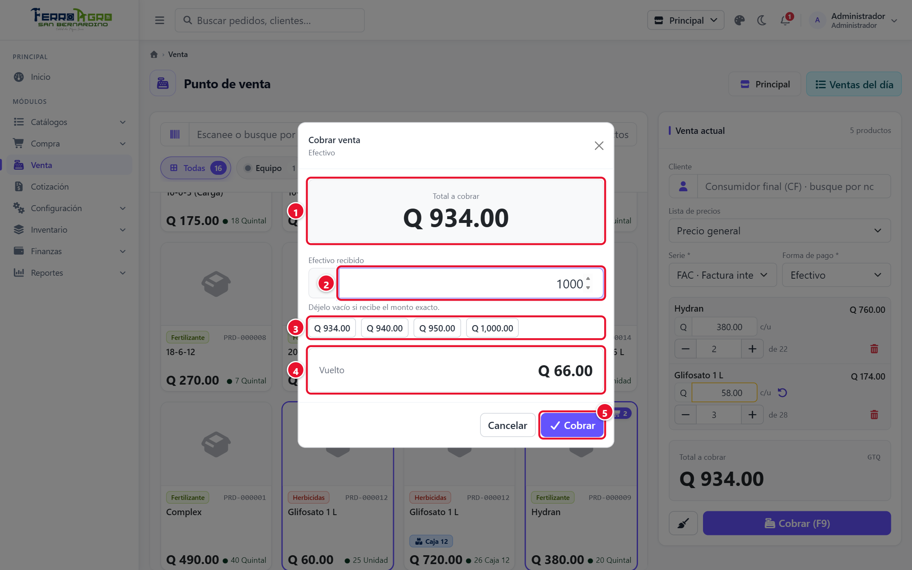

- **①** **Total a cobrar**.
- **②** **Efectivo recibido**.
- **③** Montos rápidos.
- **④** **Vuelto**.
- **⑤** **Cobrar**.

<!-- /figura -->

8. Arriba aparece *"Venta FAC-000000123 registrada por …"* con el vuelto. Pulse **Imprimir ticket** para imprimirla.

<!-- figura -->

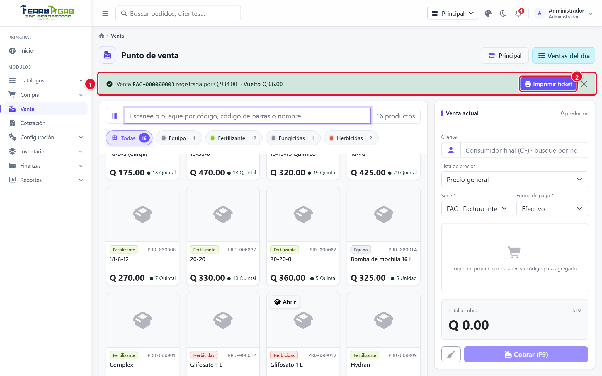

- **①** Aviso con el número de la venta, el total y el vuelto.
- **②** **Imprimir ticket**.

<!-- /figura -->

El ticket sale en rollo de 80 mm o en hoja carta, según el **Formato de impresión** de [Parámetros](02-configuracion.md#parámetros).

<!-- figura -->

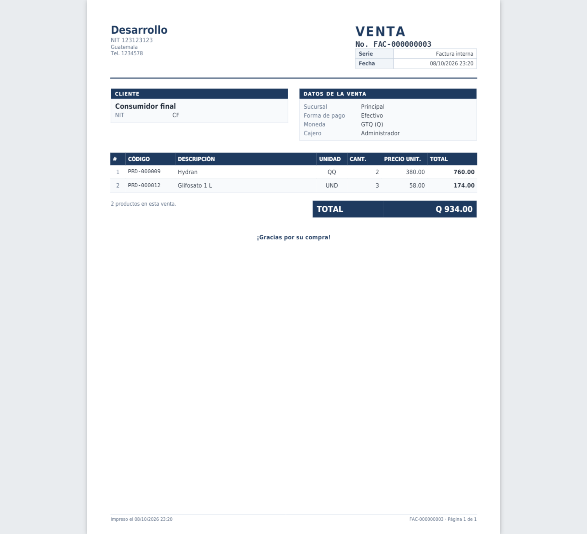

<!-- /figura -->

### Cambiar el precio de una línea

En la venta actual puede escribir otro precio en una línea. **Nunca puede ser menor al costo**; si lo intenta, el sistema avisa *"El precio de … no puede ser menor al costo"*. Un botón al lado del precio permite **volver al precio de venta**.

### Lista de precios

Debajo del cliente está el selector **Lista de precios**:

- Al elegir un cliente que tiene lista, el sistema la propone y las tarjetas y líneas pasan a esos precios.
- El vendedor puede cambiarla o elegir **Precio general**, con o sin cliente.
- Lo que no está en la lista se cobra al precio general.
- Las líneas cuyo precio cambió a mano conservan su precio.
- Después de cobrar o vaciar, vuelve al precio general.

### Venta al crédito

- Necesita un **cliente con crédito autorizado** (no puede ser Consumidor final). Si no, el sistema avisa *"Una venta al crédito necesita un cliente con crédito autorizado."*
- Si el cliente tiene límite, el total no puede pasar de lo que le queda disponible (límite − lo que debe).
- La venta queda en estado **Creado** hasta que se pague; se cobra en [Cuentas por cobrar](07-finanzas.md#cuentas-por-cobrar).

<!-- figura -->

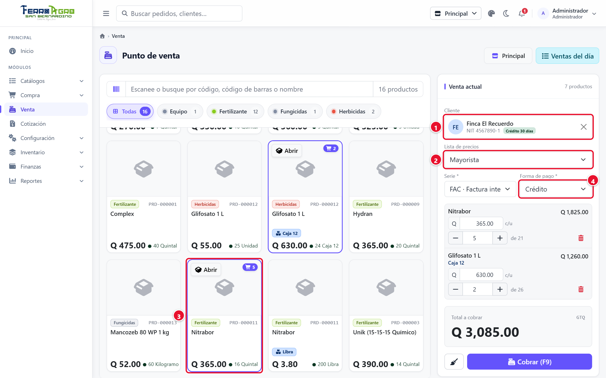

- **①** Cliente con crédito (30 días).
- **②** Se propuso su **Lista de precios** (Mayorista); las tarjetas muestran esos precios.
- **③** Precio de lista en la tarjeta (Nitrabor a Q 365.00 en vez de Q 380.00).
- **④** **Forma de pago**: Crédito.

<!-- /figura -->

<!-- figura -->

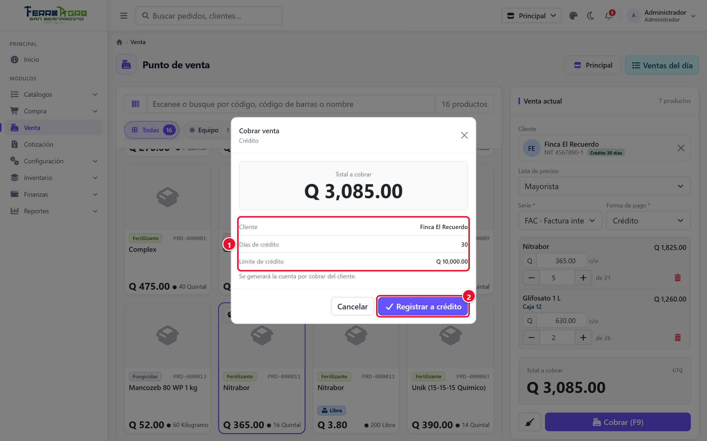

- **①** Cliente, días y límite de crédito.
- **②** **Registrar a crédito**.

<!-- /figura -->

### Abrir una caja (presentación) desde el punto de venta

Si un cliente quiere unidades sueltas y solo hay cajas:

1. En la tarjeta de la presentación (o en la de la unidad, si el producto tiene presentaciones más pequeñas) pulse **Abrir**.
2. Indique cuántas abrir y confirme.
3. La existencia de la caja baja y la de las unidades sube. Ya puede venderlas.

<!-- figura -->

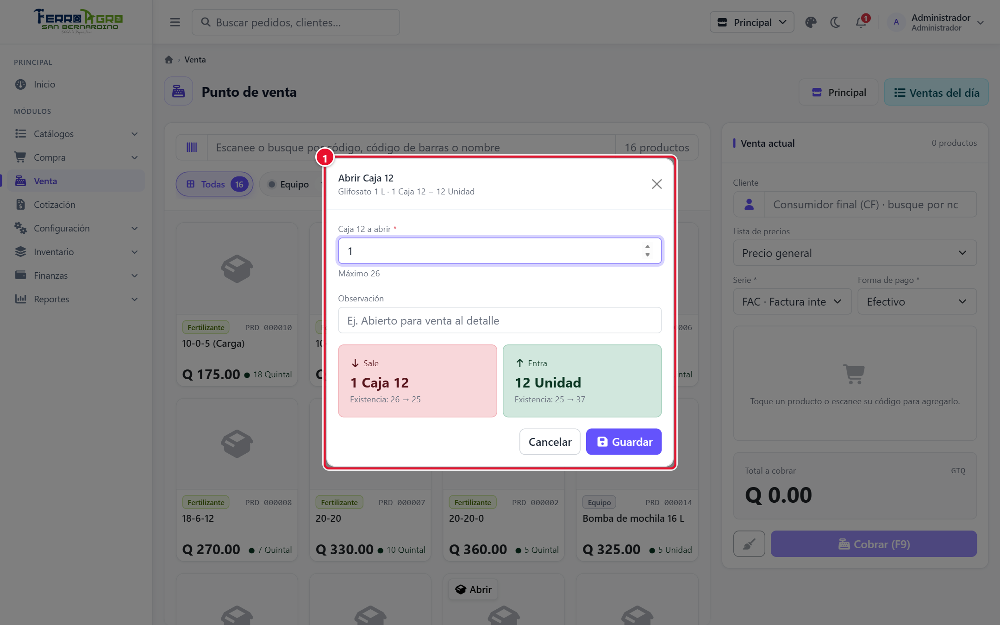

- **①** Cuántas abrir; abajo se ve lo que **Sale** (1 Caja 12) y lo que **Entra** (12 unidades) con las existencias antes y después.

<!-- /figura -->

Esto es una [conversión](06-inventario.md#conversiones) y queda registrada en el kardex. El sistema **nunca abre cajas solo** al vender.

### Reglas importantes

- **No se vende sin existencia.** Si al cobrar algo ya no alcanza, la venta completa se cancela con el mensaje *"No hay existencia suficiente de…"*.
- Se descuenta primero lo que **vence antes**.
- El punto de venta **no** aplica descuentos ni IVA. Los descuentos solo llegan desde una [cotización](#cotizaciones).

### Ventas del día

El botón **Ventas del día** muestra las ventas de la sucursal (por fechas **Desde / Hasta** y **Estado**, con buscador por número, cliente o cajero). Un usuario que no es administrador solo ve las suyas.

<!-- figura -->

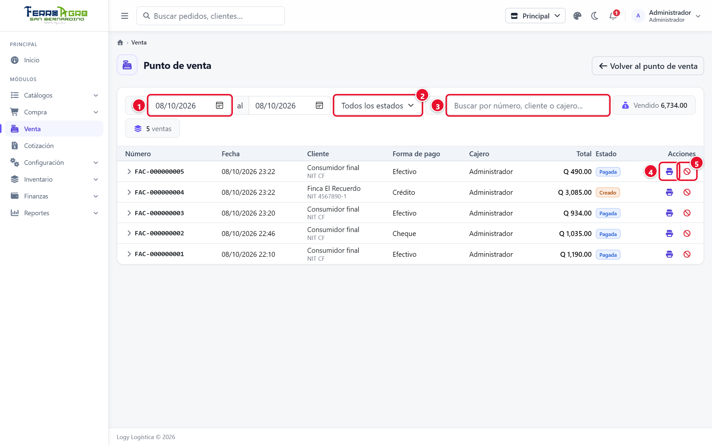

- **①** Fechas.
- **②** **Estado**.
- **③** Buscador.
- **④** **Imprimir ticket**.
- **⑤** **Anular venta**.

<!-- /figura -->

- Haga clic en una venta para ver sus productos.
- **Imprimir ticket**: vuelve a imprimirla.
- **Anular venta**: ver abajo.
- **Volver al punto de venta** regresa a vender.

### Anular una venta

1. En **Ventas del día**, pulse **Anular venta** en la fila.
2. Escriba el **Motivo** y confirme con **Anular**.

El sistema devuelve los productos a la existencia (al mismo lote del que salieron) y, si era al crédito, anula la cuenta por cobrar.

<!-- figura -->

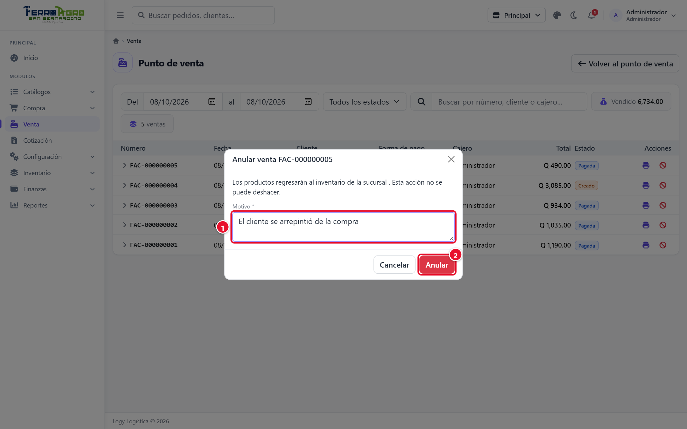

- **①** **Motivo**.
- **②** **Anular**.

<!-- /figura -->

> No se puede anular una venta al crédito que ya tiene abonos: primero anule los abonos en [Cuentas por cobrar](07-finanzas.md#anular-un-abono).

### Estados de una venta

| Estado | Significado |
|---|---|
| **Pagada** | Venta de contado, o al crédito ya pagada por completo. |
| **Creado** | Venta al crédito con saldo pendiente. |
| **Anulada** | Se anuló; devolvió la existencia. |

### En el teléfono

<!-- figura -->

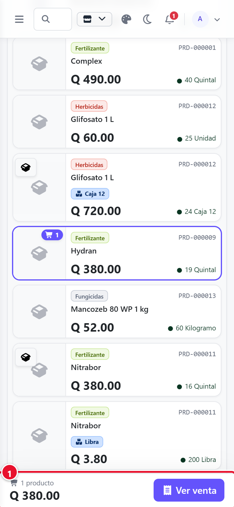

- **①** Barra inferior con productos, total y **Ver venta**.

<!-- /figura -->

- La venta actual se abre como un panel desde abajo con el botón **Ver venta**.
- Una barra fija abajo muestra la cantidad de productos y el total.
- **Cobrar** cierra el panel y abre la ventana de cobro.

<!-- figura -->

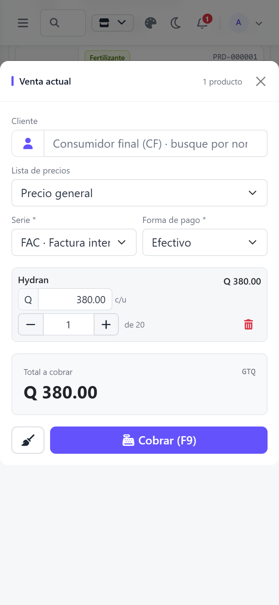

<!-- /figura -->

---

## Cotizaciones

Menú **Cotización**. Una cotización es una propuesta de precios para un cliente. No mueve inventario hasta que se **convierte en venta**.

### Flujo de una cotización

```
Borrador ─► Enviada ─► Aceptada ─► Convertida (en venta)
               └─────► Rechazada
Borrador, Enviada o Aceptada ─► Anulada (con motivo)
```

| Estado | Qué se puede hacer |
|---|---|
| **Borrador** | Editar todo. **Enviar al cliente**, **Anular**. |
| **Enviada** | **Marcar aceptada**, **Marcar rechazada**, **Anular**. |
| **Aceptada** | **Convertir en venta**, **Anular**. |
| **Convertida** | Ver la venta que generó (**Imprimir ticket**). |
| **Rechazada / Anulada** | Solo consultar, imprimir o **Duplicar**. |

Una cotización está **vencida** cuando pasó su fecha **Válida hasta**: ya no se puede enviar, aceptar ni convertir. Para volver a cotizar, use **Duplicar**.

La lista tiene indicadores de **Abiertas**, **Por vencer (3 días)**, **Monto en cotización** y **Tasa de cierre**, además de filtros por fechas, estado y buscador.

### Cómo se ve una cotización abierta

- **Arriba**: **Cotizaciones** (volver a la lista), **PDF**, el menú **Más** (con **Duplicar**, **Marcar rechazada** y **Anular**) y **un solo botón principal** con el siguiente paso según el estado: **Enviar al cliente**, **Marcar aceptada** o **Convertir en venta**.
- **Avance**: los pasos de la cotización (Borrador → Enviada → Aceptada → Convertida), con la fecha de cada uno.
- **Centro**: los productos.
- **Derecha**: el **Resumen** (total, subtotal, descuento y **Ganancia estimada (interna)**, que no sale en el PDF) y debajo los **Datos de la cotización**.

<!-- figura -->

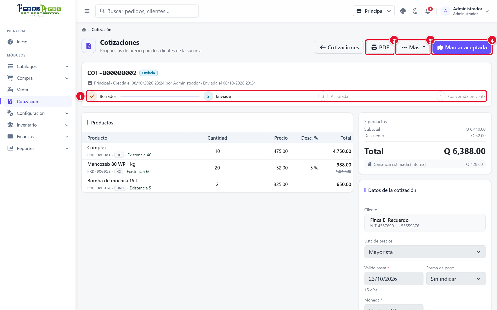

- **①** **Avance**: Borrador → Enviada → Aceptada → Convertida.
- **②** **PDF**.
- **③** **Más**: Duplicar, Marcar rechazada, Anular.
- **④** Botón del siguiente paso (**Marcar aceptada**).

<!-- /figura -->

### Crear una cotización

1. Pulse **Nueva cotización**.
2. **Datos de la cotización**:
   - **Cliente** (o Consumidor final). Puede crear uno nuevo.
   - **Lista de precios**: se propone la del cliente; se puede cambiar o dejar en **Precio general**.
   - **Serie**, **Moneda** y **Forma de pago** (o *Sin indicar*).
   - **Válida hasta**: 15 días por defecto; los atajos **7**, **15** y **30** días la calculan desde hoy.
   - **Referencia y condiciones** (bloque plegable, *Salen en el PDF*): **Referencia** (ej. *Proyecto bodega norte*), **Condiciones** (ej. *Entrega en 3 días hábiles*) y **Observaciones**.
   - Pulse **Guardar**. Recibe su número (ej. `COT-000000002`).

<!-- figura -->

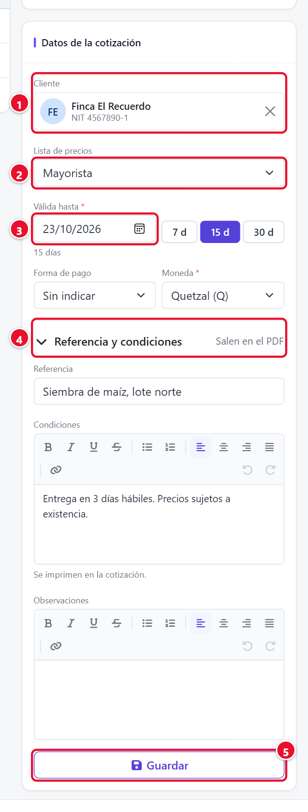

- **①** **Cliente**.
- **②** **Lista de precios**.
- **③** **Válida hasta** (atajos 7, 15 y 30 días).
- **④** **Referencia y condiciones** (salen en el PDF).
- **⑤** **Guardar**.

<!-- /figura -->

3. **Productos**: escriba en el buscador el nombre, el código o escanee el código de barras.
   - Aparecen hasta 8 sugerencias: elija con las flechas y Enter, o con un clic.
   - Un código exacto con Enter se agrega de inmediato (útil con el lector).
   - **Catálogo** abre la lista completa con filtro por categoría; **Nuevo producto** crea uno y lo agrega con cantidad 1.
4. En cada línea:
   - Debajo del nombre están el código, la **existencia** y la unidad o el selector de **Presentación**.
   - **Cantidad** (con **−** / **+** o escribiéndola; se guarda sola) y **Precio** (propuesto de la lista o del precio general).
   - **Desc. %**: descuento de la línea. El precio con descuento **no puede quedar por debajo del costo**.
   - **Nota para el cliente**: texto que sale bajo el producto en la cotización.
   - La papelera quita la línea.
5. El **Resumen** se actualiza solo. Si hay productos sin existencia suficiente lo avisa, **solo como aviso**: se puede cotizar aunque no haya.

<!-- figura -->

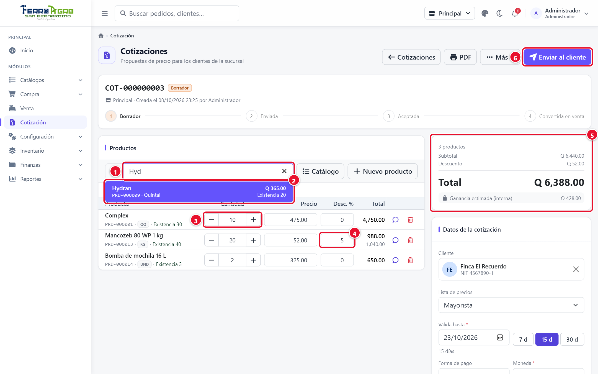

- **①** Buscador.
- **②** Sugerencias (flechas + Enter o clic).
- **③** Cantidad con **−** / **+**.
- **④** **Desc. %** de la línea.
- **⑤** **Resumen** con la ganancia estimada (interna).
- **⑥** **Enviar al cliente**.

<!-- /figura -->

Cambiar la lista de precios y guardar afecta solo lo que se agregue después; las líneas ya agregadas conservan su precio.

### Enviar, aceptar o rechazar

- **PDF**: genera la cotización en hoja carta para enviarla al cliente.
- **Enviar al cliente**: la marca como enviada (necesita al menos un producto y no estar vencida). Desde aquí ya no se edita.
- Cuando el cliente responde: **Marcar aceptada**, o **Más › Marcar rechazada**.

<!-- figura -->

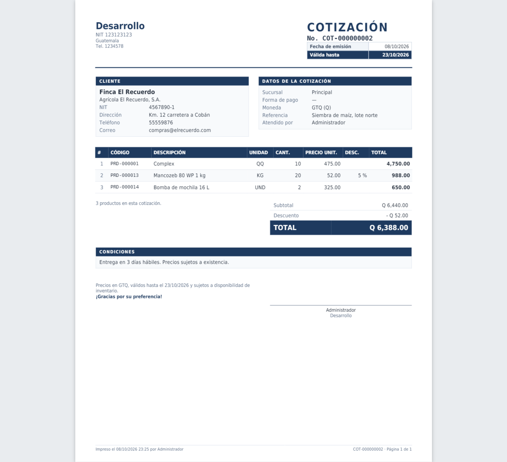

<!-- /figura -->

<!-- figura -->

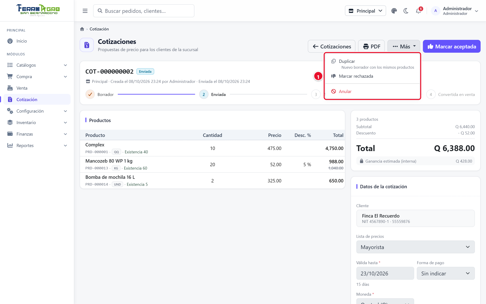

- **①** **Duplicar**, **Marcar rechazada** y **Anular**.

<!-- /figura -->

### Convertir en venta

Cuando el cliente confirma la compra (cotización **Aceptada** y no vencida):

1. Pulse **Convertir en venta**.
2. Elija la **Serie** y la **Forma de pago** de la venta. Al crédito se genera la cuenta por cobrar (el cliente debe tener crédito autorizado).
3. Pulse **Registrar venta**.

<!-- figura -->

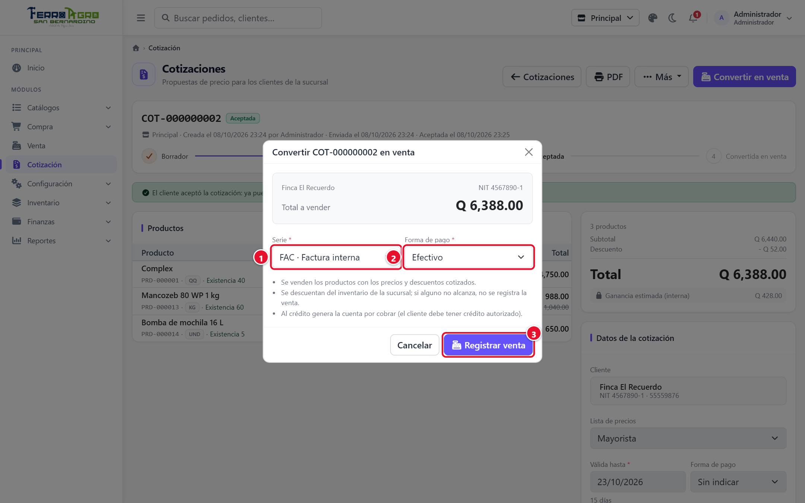

- **①** **Serie**.
- **②** **Forma de pago**.
- **③** **Registrar venta**.

<!-- /figura -->

La venta se registra **con los precios y descuentos cotizados**. Los productos se descuentan del inventario de la sucursal; si alguno no alcanza, no se registra la venta. La cotización pasa a **Convertida** y el ticket muestra el descuento de cada línea.

<!-- figura -->

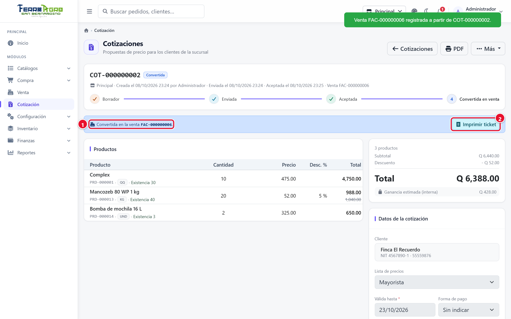

- **①** Número de la venta generada.
- **②** **Imprimir ticket** de esa venta.

<!-- /figura -->

<!-- figura -->

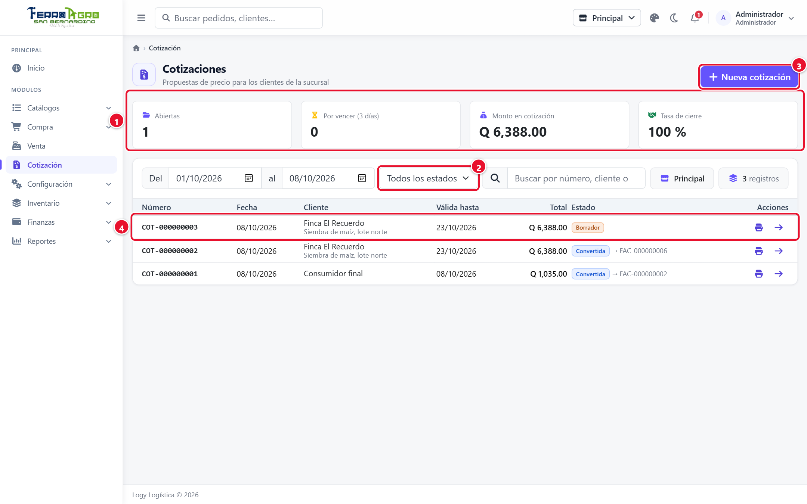

- **①** Indicadores: Abiertas, Por vencer, Monto en cotización y Tasa de cierre.
- **②** **Estado**.
- **③** **Nueva cotización**.
- **④** Borrador creado con **Duplicar**.

<!-- /figura -->

### Duplicar

**Más › Duplicar** crea un **borrador nuevo** con el mismo cliente, productos, precios y descuentos, válido 15 días desde hoy. Si algún producto o presentación ya está inactivo, lo omite y lo avisa. Es la forma de "renovar" una cotización vencida.

### Anular

**Más › Anular** pide un **Motivo**. La cotización ya no se podrá enviar ni aceptar. No se puede deshacer.
