# 6 · Inventario

[← Índice](README.md)

Menú **Inventario**. Todo se trabaja **en la sucursal de trabajo**: cada sucursal tiene su propia existencia.

## Cómo lleva Logy la existencia

- La existencia de un producto se separa por **presentación** (unidad, caja, fardo…) y por **lote** (fecha de vencimiento). 5 cajas son 5 cajas, no 60 unidades.
- Toda entrada o salida (compra, venta, ajuste, traslado, conversión, inventario inicial) queda registrada como un **movimiento** y se puede ver en el [kardex](#kardex).
- Al sacar producto (venta, ajuste de salida, traslado), el sistema toma primero lo que **vence antes**; lo que no vence sale al final.
- Nunca se saca más de lo que hay: si no alcanza, la operación completa se cancela.

---

## Existencias

**Inventario › Existencias**. Lo que hay hoy en la sucursal.

- Muestra cada producto (tipo bien) con su **Categoría**, **Marca**, **Unidad**, **Existencia**, **Mínimo**, **Próx. vence** (el lote que vence primero), **Costo** y **Valor** (existencia × costo). Las presentaciones aparecen debajo de su producto.
- Arriba se resume cuántos productos hay **Con existencia**, **Bajo mínimo** y **Sin existencia**. Haga clic en uno para filtrar la tabla.
- Filtros: buscador (nombre o código), **Categoría**, **Marca** y **Estado**.
- **Actualizar** recarga los datos; **Excel** descarga lo que se ve en la tabla.

---

<!-- figura -->

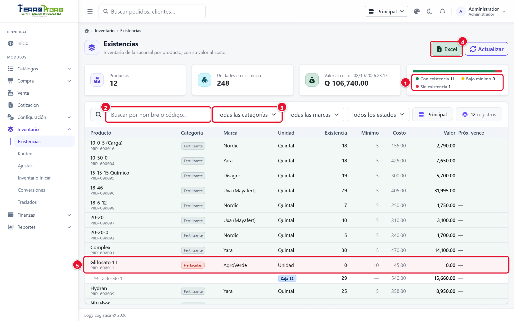

- **①** Resumen por estado (clic para filtrar).
- **②** Buscador.
- **③** Filtros: categoría, marca y estado.
- **④** **Excel**.
- **⑤** Producto con su presentación debajo (Glifosato 1 L y su Caja 12).

<!-- /figura -->

## Kardex

**Inventario › Kardex**. Historial de entradas y salidas.

1. Elija el período (**Desde / Hasta**, o los atajos **Este mes**, **Mes anterior**, **Últimos 90 días**, **Este año**, **Todo**).
2. Opcional: elija un **Producto** (sin producto se ven todos), su **Presentación** y un **Lote (vence)**.
3. Filtre por **Todos**, **Entradas** o **Salidas**, o busque por documento, detalle o usuario.

- Lo más reciente aparece arriba; la fila de **Saldo inicial** (lo que había antes del período) va al final.
- Con un producto elegido se muestra la operación **Saldo inicial + Entradas − Salidas = Saldo final**.
- La columna del documento indica de dónde viene cada movimiento (número de compra, venta, ajuste, traslado…). Haga clic en un producto para ver solo su kardex.
- **Excel** descarga el kardex del período en orden cronológico.

<!-- figura -->

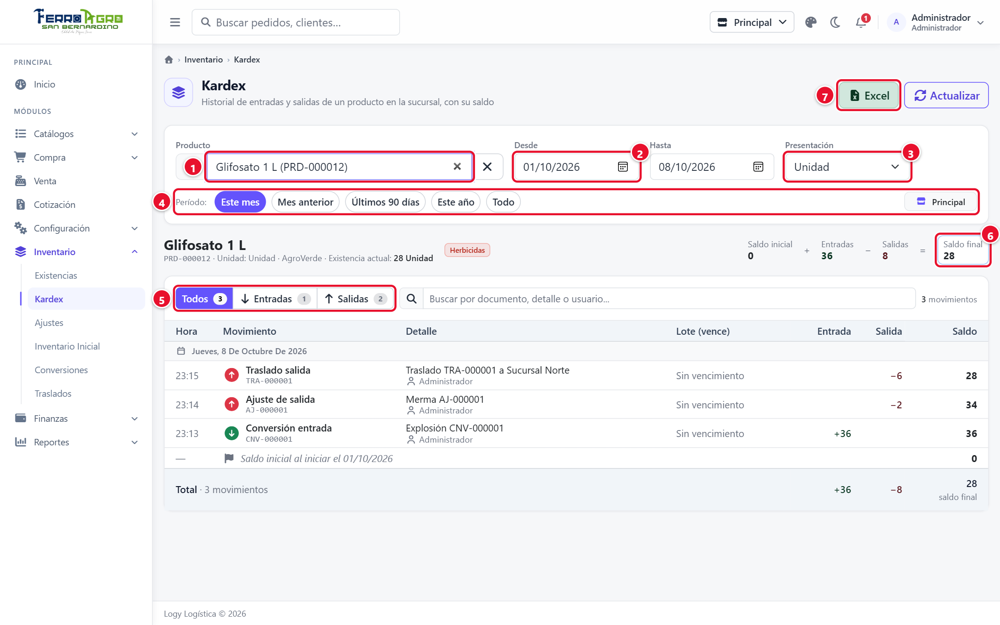

- **①** **Producto**.
- **②** Período **Desde / Hasta**.
- **③** **Presentación**.
- **④** Atajos de período.
- **⑤** **Todos / Entradas / Salidas**.
- **⑥** **Saldo final**.
- **⑦** **Excel**.

<!-- /figura -->

### Tipos de movimiento

| Movimiento | Origen |
|---|---|
| Recepción | Compra recibida |
| Venta / Anulación de venta | Punto de venta o cotización convertida |
| Ajuste de entrada / de salida (y sus anulaciones) | [Ajustes](#ajustes) |
| Inventario positivo (y su anulación) | [Inventario inicial](#inventario-inicial) |
| Conversión entrada / salida | [Conversiones](#conversiones) |
| Traslado salida / entrada / Anulación de traslado salida | [Traslados](#traslados) |

---

## Ajustes

**Inventario › Ajustes**. Corrigen la existencia por mermas, productos dañados o vencidos, consumo interno o producto recuperado.

### Estados

| Estado | Significado |
|---|---|
| **Borrador** | Se está armando; no ha movido inventario. |
| **Aplicado** | Ya movió la existencia. No se edita. |
| **Anulado** | Se canceló. Si estaba aplicado, el sistema revirtió lo que había movido. |

### Hacer un ajuste

1. Pulse **Nuevo ajuste**.
2. Elija el **Sentido**: **Entrada** (suma) o **Salida** (resta).
3. Elija el **Tipo de ajuste**:
   - Entrada: *Recuperación de producto*.
   - Salida: *Merma*, *Producto dañado*, *Producto vencido*, *Consumo interno*.
4. Escriba la **Observación** (ej. *Producto roto al descargar el camión*). Es obligatoria en los tipos que lo indican.
5. Pulse **Guardar**. El ajuste recibe su número (ej. `AJ-000001`).
<!-- figura -->

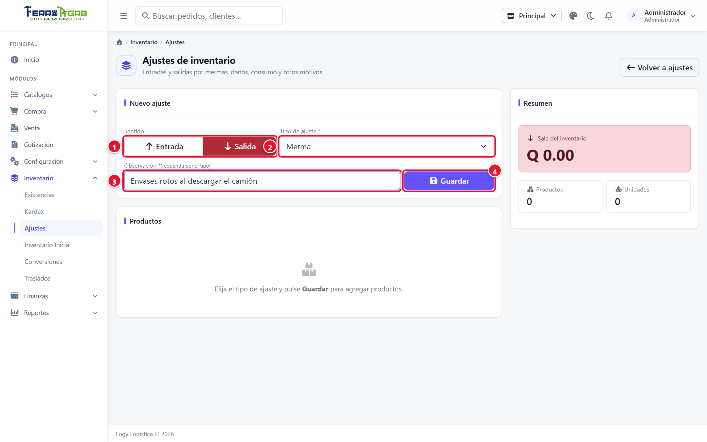

- **①** **Sentido**: Entrada o Salida.
- **②** **Tipo de ajuste**.
- **③** **Observación**.
- **④** **Guardar**.

<!-- /figura -->

6. Agregue los productos (código o **Ver productos**). En cada línea:
   - **Presentación** y **Cantidad** (siempre positiva; el sentido lo da el tipo).
   - **Salida**: el lote puede quedar en **Automático (vence primero)** o elegir un lote específico. Se muestra la **Existencia** de cada lote.
   - **Entrada**: indique la fecha de **vencimiento** del lote (o *Sin vencimiento*).
7. Revise el **Resumen** (productos, unidades y valor al costo actual).
8. Pulse **Aplicar ajuste** y confirme. El costo de cada línea queda fijo en ese momento.

<!-- figura -->

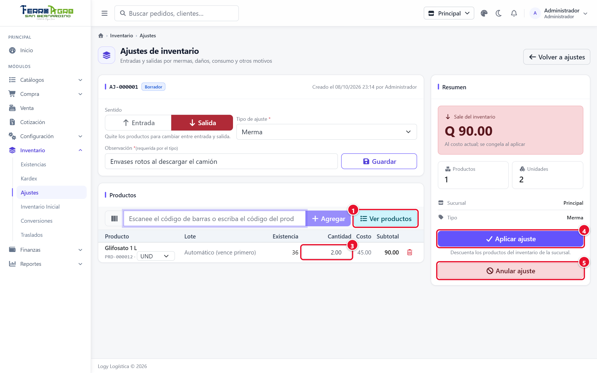

- **①** **Ver productos**.
- **②** **Cantidad**.
- **③** **Aplicar ajuste**.
- **④** **Anular ajuste**.

<!-- /figura -->

<!-- figura -->

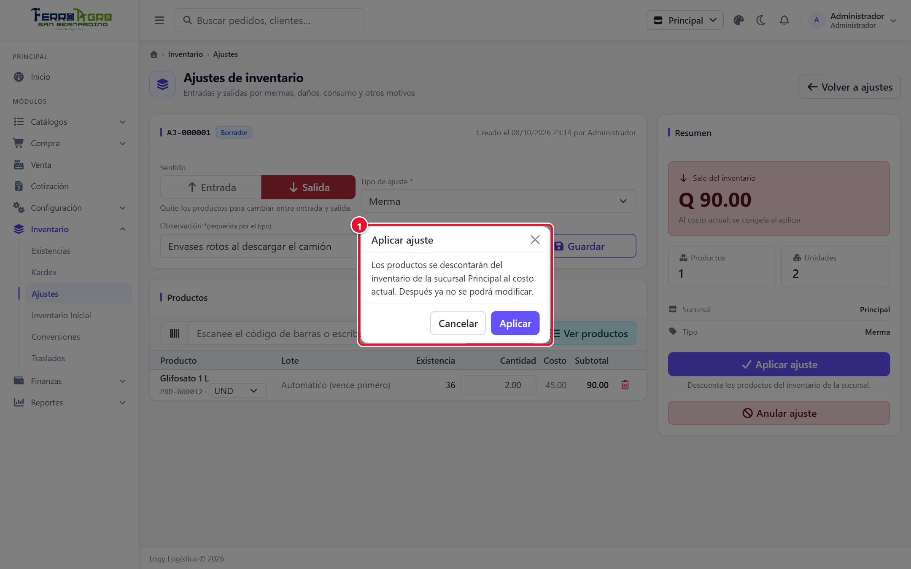

- **①** Ventana de confirmación: **Aplicar**.

<!-- /figura -->

> Para cambiar entre entrada y salida hay que quitar primero los productos.

### Anular un ajuste

Pulse **Anular ajuste**, escriba el **Motivo** y confirme.

- Un **borrador** solo queda anulado.
- Un **aplicado** se revierte: una salida devuelve la existencia y una entrada la retira. Una entrada **no se puede anular** si ese producto ya salió del lote (por ejemplo, ya se vendió).

---

<!-- figura -->

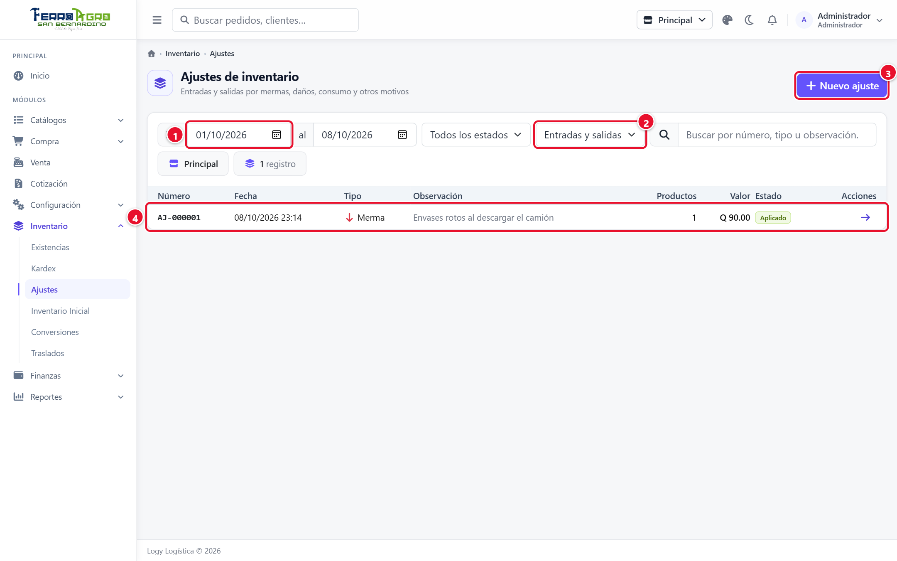

- **①** Fechas.
- **②** **Entradas y salidas**.
- **③** **Nuevo ajuste**.
- **④** Ajuste aplicado.

<!-- /figura -->

## Inventario inicial

**Inventario › Inventario Inicial**. Carga la existencia desde un archivo de Excel. Se usa al empezar a trabajar con Logy o al abrir una sucursal, y se puede hacer **por partes** (varios archivos).

### Paso 1: preparar el archivo

1. Pulse **Descargar plantilla**. El archivo trae las hojas **Productos** (la que se llena), **Ejemplo**, **Instrucciones** y **Unidades**.
2. Llene la hoja **Productos**, una fila por producto y lote:

| Columna | Obligatoria | Notas |
|---|---|---|
| **Nombre del producto** | Sí | Hasta 300 caracteres. Si la fila no trae código de barras, se usa para saber si el producto ya existe. |
| **Descripción** | No | Texto libre. |
| **Código de barras** | No | Si viene, se usa primero para buscar el producto. Escríbalo como texto para no perder ceros. |
| **Categoría** | Sí | Si no existe, se crea. |
| **Marca** | Sí | Si no existe, se crea. Use *Genérica* para productos sin marca. |
| **Unidad de medida** | Sí | Elíjala de la hoja *Unidades*; si no existe, se crea. |
| **Costo unitario** | Sí | Por unidad de medida, 0 o más. |
| **Precio de venta** | Sí | Por unidad de medida, mayor que 0. |
| **Existencia mínima** | No | Por defecto 0. |
| **Controla vencimiento** | No | *Sí* o *No* (por defecto *No*). |
| **Fecha de vencimiento** | Si controla vencimiento | Formato dd/mm/aaaa. Cada fecha es un lote. |
| **Cantidad** | Sí | Mayor que 0, en la unidad de medida. |

<!-- figura -->

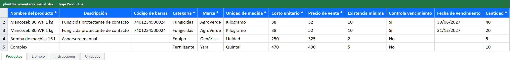

<!-- /figura -->

### Paso 2: importar

1. Pulse **Nuevo inventario inicial** (si ya hay un borrador abierto, el botón dice **Importar a INV-…**) y arrastre el archivo a la ventana **Importar productos desde Excel** (o haga clic para elegirlo). Máximo 5 MB y 2000 filas.
2. El sistema **revisa el archivo sin guardar nada** y muestra cada fila como correcta, **Con aviso** o **Con errores**, cuántos productos son **nuevos** y cuántos **existentes**, y el **Valor al costo**.
3. Si hay errores, corrija las filas marcadas en el Excel y vuelva a subirlo.
4. Sin errores, pulse **Importar N filas**. Las filas pasan al **borrador** del inventario inicial (o a uno nuevo si no hay borrador).

<!-- figura -->

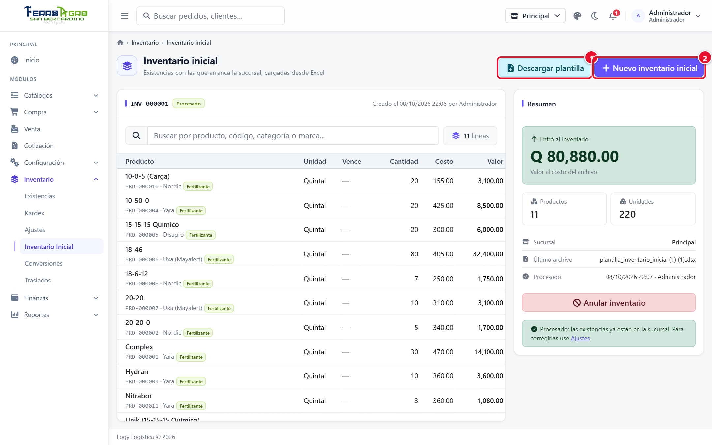

- **①** **Descargar plantilla**.
- **②** **Nuevo inventario inicial** (importar un Excel).

<!-- /figura -->

<!-- figura -->

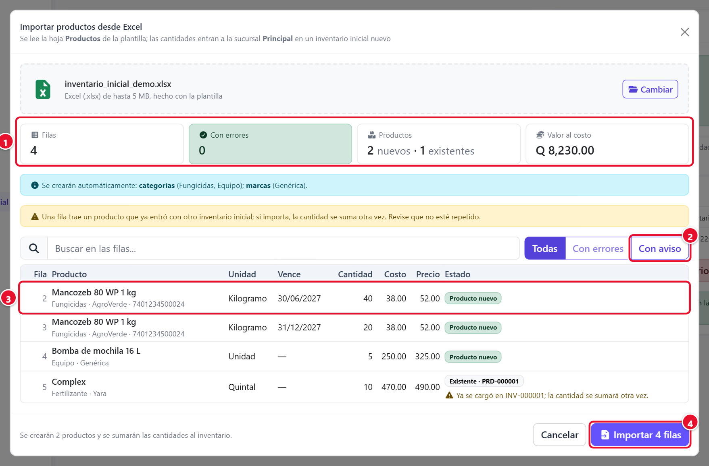

- **①** Resumen: filas, errores, productos nuevos y existentes, valor al costo.
- **②** Filtros **Todas / Con errores / Con aviso**.
- **③** Fila: producto nuevo.
- **④** **Importar 4 filas**.

<!-- /figura -->

Puede importar varios archivos al mismo borrador: las cantidades se suman. El sistema no deja subir dos veces el mismo archivo al mismo borrador. Con **Quitar del inventario** saca un producto del borrador.

### Paso 3: procesar

Revise la lista y pulse **Procesar inventario**; confirme con **Procesar**. Las cantidades se **suman** a la existencia de la sucursal. Después ya no se puede importar ni quitar productos de ese inventario.

<!-- figura -->

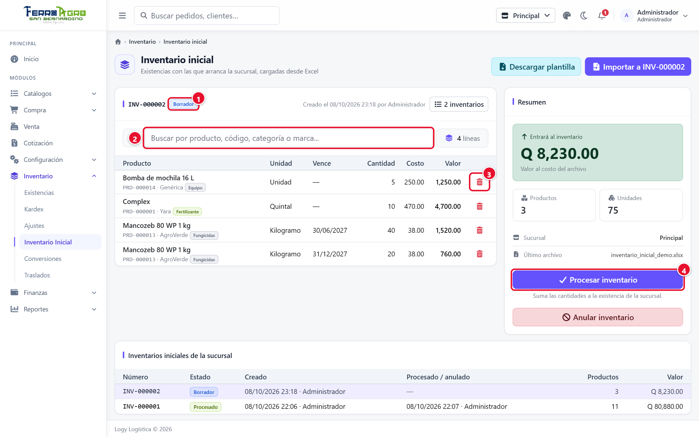

- **①** Estado **Borrador**.
- **②** Buscador.
- **③** Quitar un producto del borrador.
- **④** **Procesar inventario**.

<!-- /figura -->

<!-- figura -->

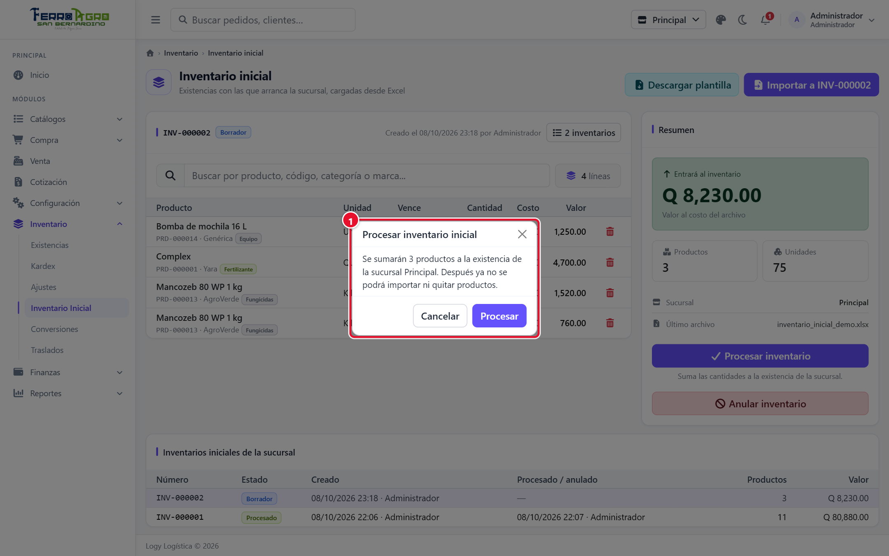

- **①** Ventana de confirmación: **Procesar**.

<!-- /figura -->

<!-- figura -->

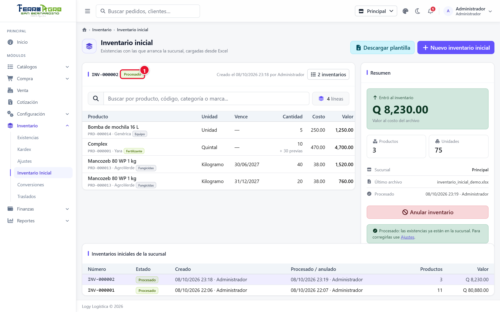

- **①** Estado **Procesado**.

<!-- /figura -->

### Reglas

- **Productos nuevos**: si un producto no existe, se crea con su código automático (ej. `PRD-000001`). La categoría, marca y unidad se crean si faltan.
- **Productos existentes**: se usan **sin cambiar sus datos** (nombre, precio, costo…). Solo se suma la cantidad.
- **Aviso de producto repetido**: si un producto ya entró con otro inventario inicial procesado de la sucursal, la fila lleva un aviso. No impide importar, pero la cantidad **se sumará otra vez**.
- Todo se carga en la **unidad de medida** del producto (no en presentaciones).
- Puede haber varios inventarios iniciales por sucursal, pero **solo un borrador abierto**. Los ve cualquier usuario de la sucursal.

### Anular un inventario inicial

Pulse **Anular inventario** y escriba el **Motivo**. Si estaba procesado, se resta lo que había entrado, **salvo que ya haya salido** (vendido, ajustado…). Los demás inventarios iniciales no se tocan.

---

## Conversiones

**Inventario › Conversiones**. Pasan existencia de una presentación a la unidad del producto, o al revés.

| Acción | Ejemplo | Qué pasa |
|---|---|---|
| **Abrir** | 1 Caja 12 → 12 Unidades · 1 Quintal → 100 Libras | Sale lo grande y entra lo pequeño, con la **misma fecha de vencimiento** del lote abierto. |
| **Armar** | 12 Unidades → 1 Caja 12 | Sale lo pequeño y entra lo grande, que **vence con lo primero que se usó**. |

### Hacer una conversión

1. Pulse **Nueva conversión**.
2. Elija el **Producto** y la **Presentación**.
3. Elija **Abrir …** o **Armar …** e indique cuántas unidades **grandes** (número entero).
4. Escriba una **Observación** (opcional; ej. *Abierto para venta al detalle*).
5. Pulse **Guardar**.

<!-- figura -->

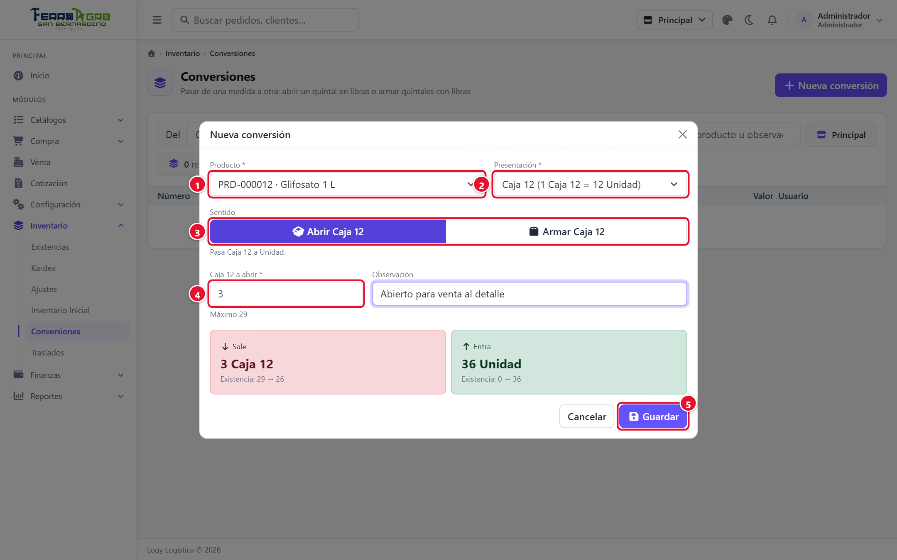

- **①** **Producto**.
- **②** **Presentación**.
- **③** **Abrir** o **Armar**.
- **④** Cantidad (lo que **Sale** y lo que **Entra** se ve abajo).
- **⑤** **Guardar**.

<!-- /figura -->

- El costo no cambia (una caja vale lo que valen sus unidades).
- **No se anulan**: si se equivocó, haga la conversión contraria.
- Una presentación inactiva solo se puede **abrir** (para sacar lo que le queda).
- Desde el punto de venta, cualquier cajero puede **abrir** con el botón **Abrir** de la tarjeta ([Ventas](05-ventas.md#abrir-una-caja-presentación-desde-el-punto-de-venta)).
- La lista se filtra por fechas y por **De presentación a unidad** / **De unidad a presentación**.

---

<!-- figura -->

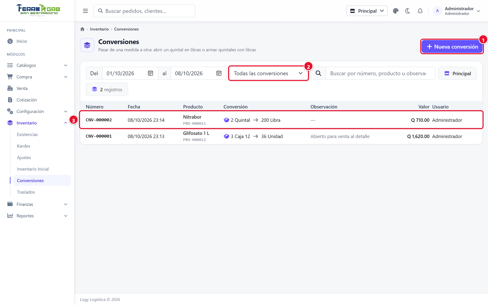

- **①** **Nueva conversión**.
- **②** Filtro por sentido.
- **③** Conversión: 2 Quintal → 200 Libra.

<!-- /figura -->

## Traslados

**Inventario › Traslados**. Envían mercadería de una sucursal a otra en dos pasos: **la que envía** lo registra y **la que recibe** lo confirma.

### Estados

| Estado | Significado |
|---|---|
| **Borrador** | El origen lo está armando. |
| **Enviado** (en el destino se ve como **Por recibir** / **En camino**) | Ya salió del inventario del origen; todavía no entra al destino. |
| **Recibido** | Ya entró al inventario del destino. |
| **Anulado** | Se canceló. Si estaba enviado, la mercadería volvió al origen. |

### Enviar (sucursal de origen)

1. Trabajando en la sucursal que envía, pulse **Nuevo traslado**.
2. Elija la **Sucursal destino** y escriba una **Observación** (ej. *Reposición semanal*). Pulse **Guardar**. Recibe su número (ej. `TRA-000001`).
3. Agregue los productos, con **Presentación**, lote (**Automático (vence primero)** o uno específico) y **Cantidad**.
4. Pulse **Enviar traslado** y confirme. Los productos se descuentan del origen y quedan **en camino**. La sucursal destino recibe un aviso en la campana.

<!-- figura -->

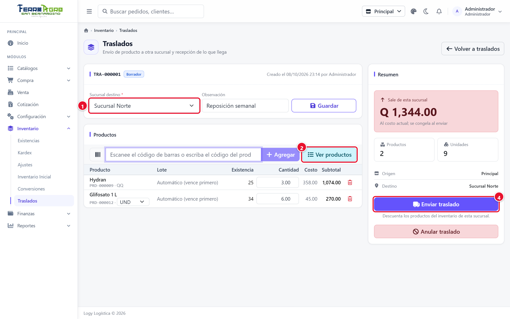

- **①** **Sucursal destino**.
- **②** **Ver productos**.
- **③** Lote: automático (vence primero) o uno específico.
- **④** **Enviar traslado**.

<!-- /figura -->

<!-- figura -->

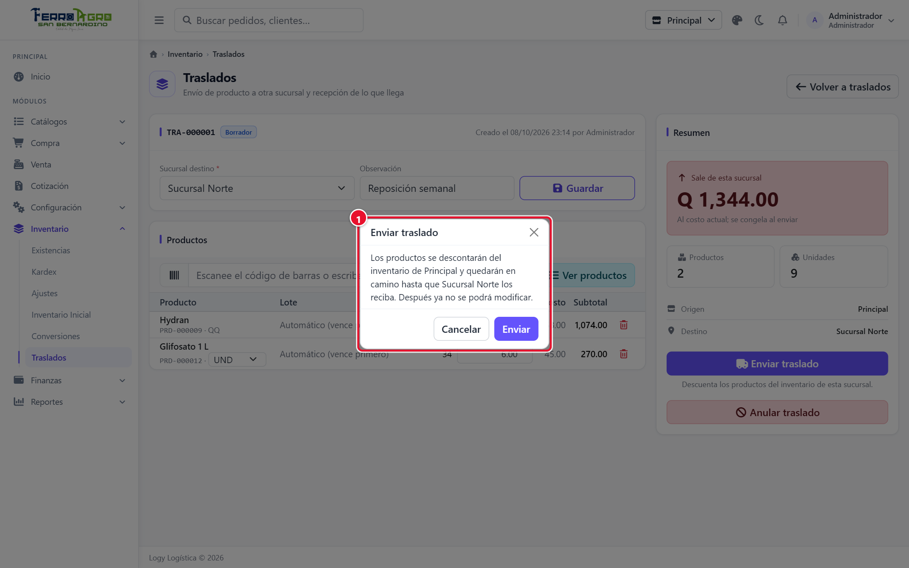

- **①** Ventana de confirmación: **Enviar**.

<!-- /figura -->

<!-- figura -->

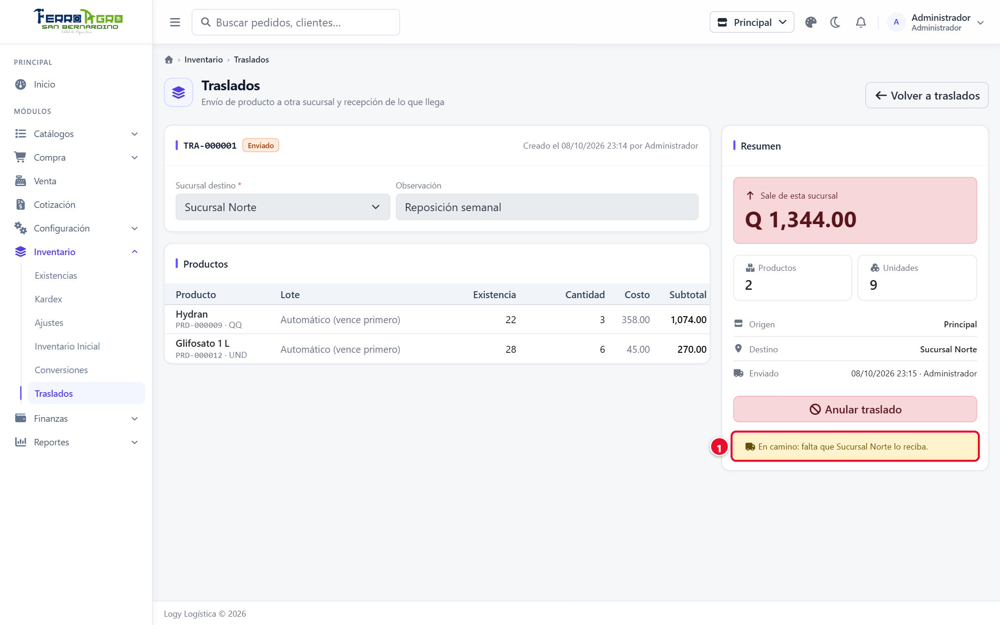

- **①** Aviso **En camino**: falta que la sucursal destino lo reciba.

<!-- /figura -->

### Recibir (sucursal destino)

1. Cambie a la sucursal destino. Abra el traslado desde la **campana** o desde la lista (filtro **Solo los que llegan**).
2. Revise los productos y pulse **Recibir traslado**. Los productos entran al inventario con el mismo vencimiento con el que salieron, y el origen recibe un aviso.

<!-- figura -->

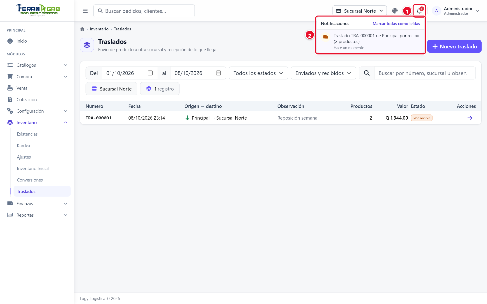

- **①** **Campana** con el número de avisos.
- **②** Aviso del traslado; un clic lo abre.

<!-- /figura -->

<!-- figura -->

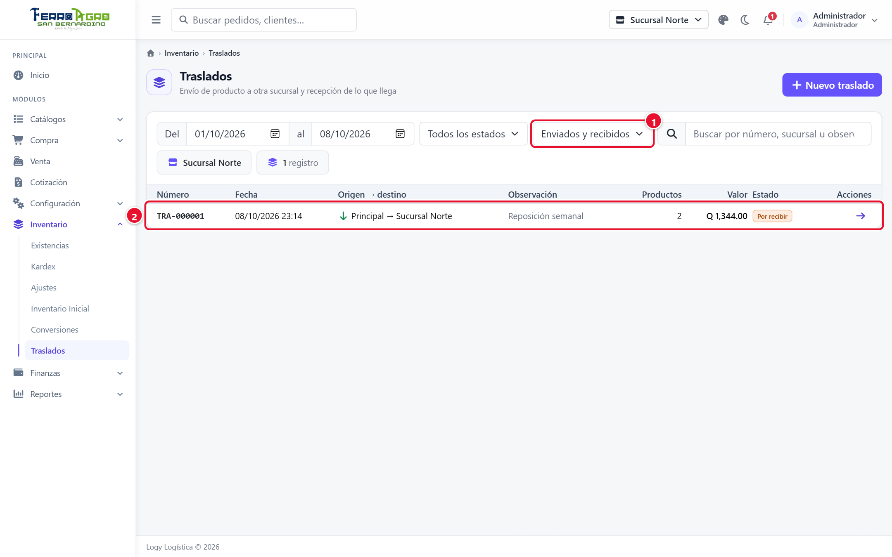

- **①** Filtro **Enviados y recibidos / Solo enviados / Solo los que llegan**.
- **②** Traslado **Por recibir**.

<!-- /figura -->

<!-- figura -->

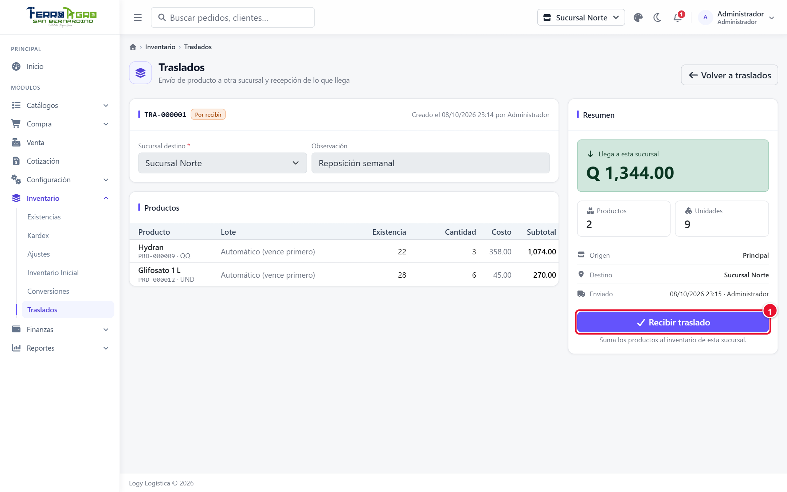

- **①** **Recibir traslado**.

<!-- /figura -->

<!-- figura -->

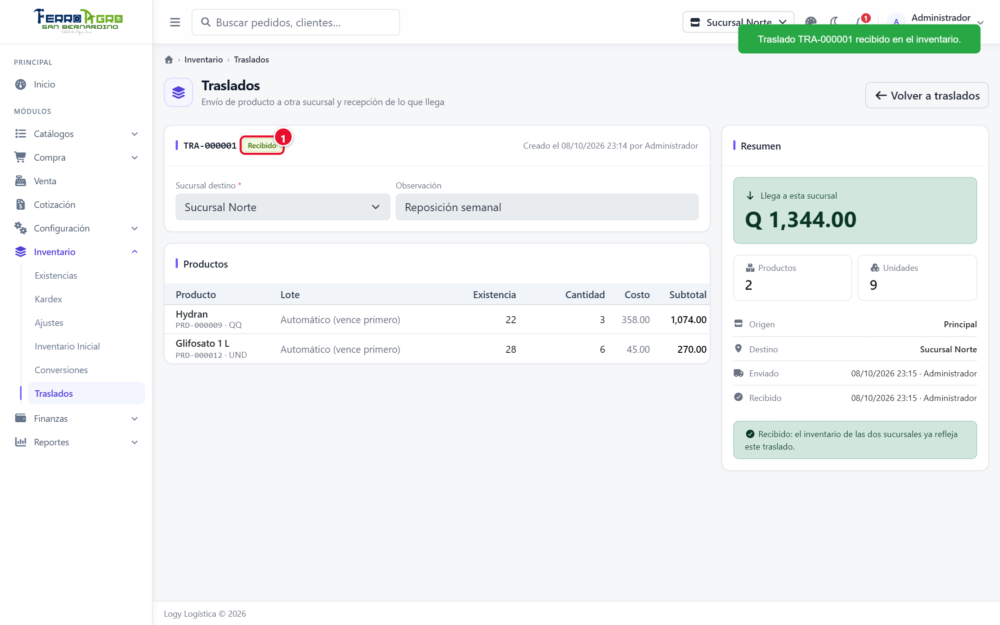

- **①** Estado **Recibido**.

<!-- /figura -->

La recepción es **completa**. Si llegó algo de menos o dañado, recíbalo y corrija la diferencia con un [ajuste](#ajustes).

### Anular

Solo la sucursal de origen, con **Anular traslado** y un **Motivo**:

- Un **borrador** solo queda anulado.
- Un **enviado** devuelve los productos a los mismos lotes del origen y avisa al destino.
- Un **recibido** no se anula: haga un traslado de regreso.

### Lista de traslados

Muestra **Origen → destino** y la dirección de cada uno. Filtro **Enviados y recibidos** / **Solo enviados** / **Solo los que llegan**, además de fechas y estado.

> Mientras un traslado está en camino, esos productos no aparecen en las existencias de ninguna de las dos sucursales.
