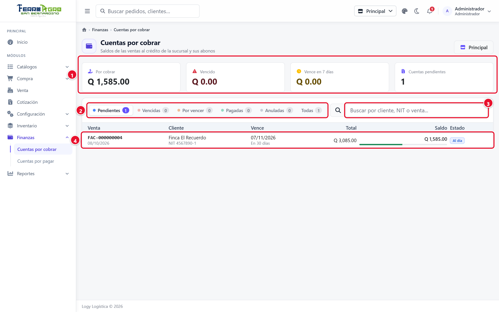
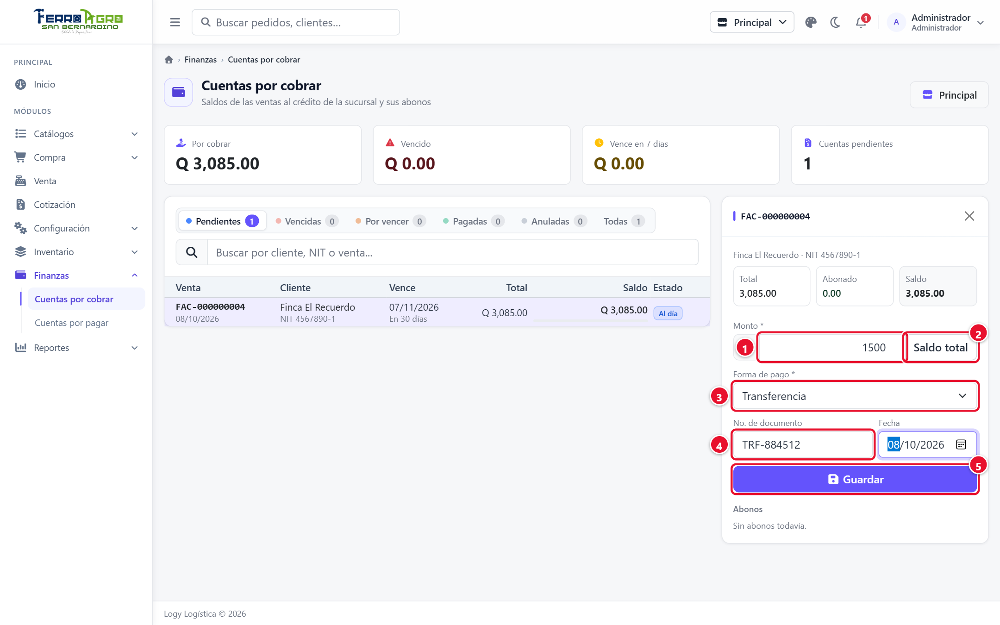
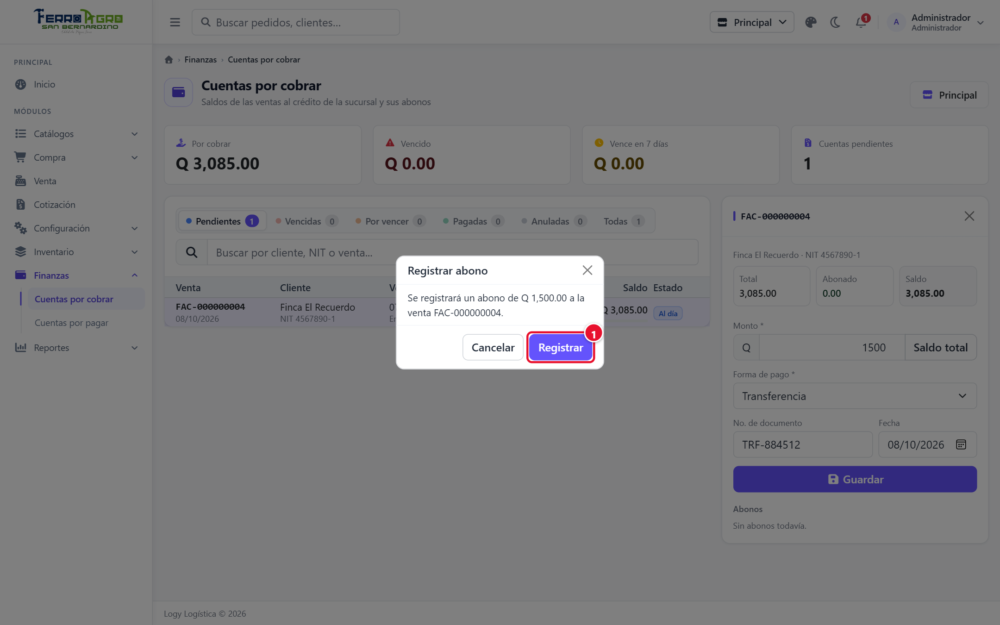
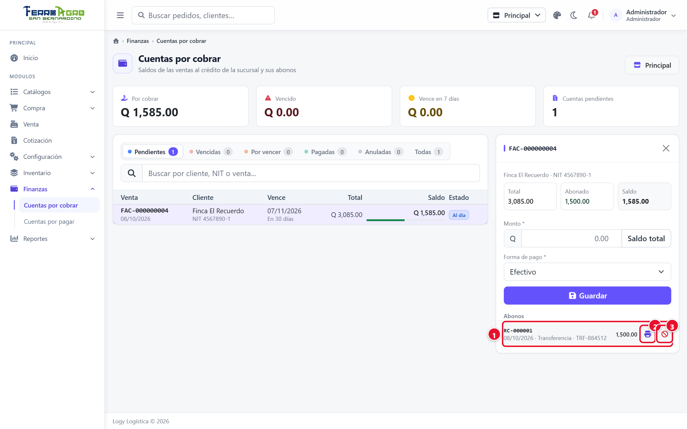
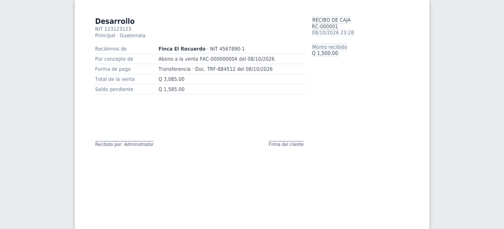
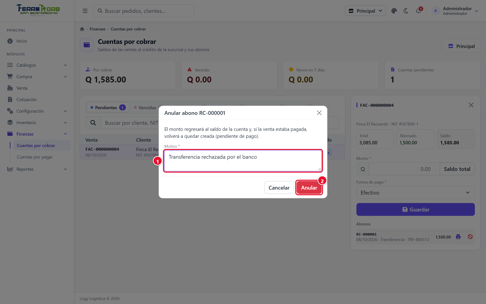
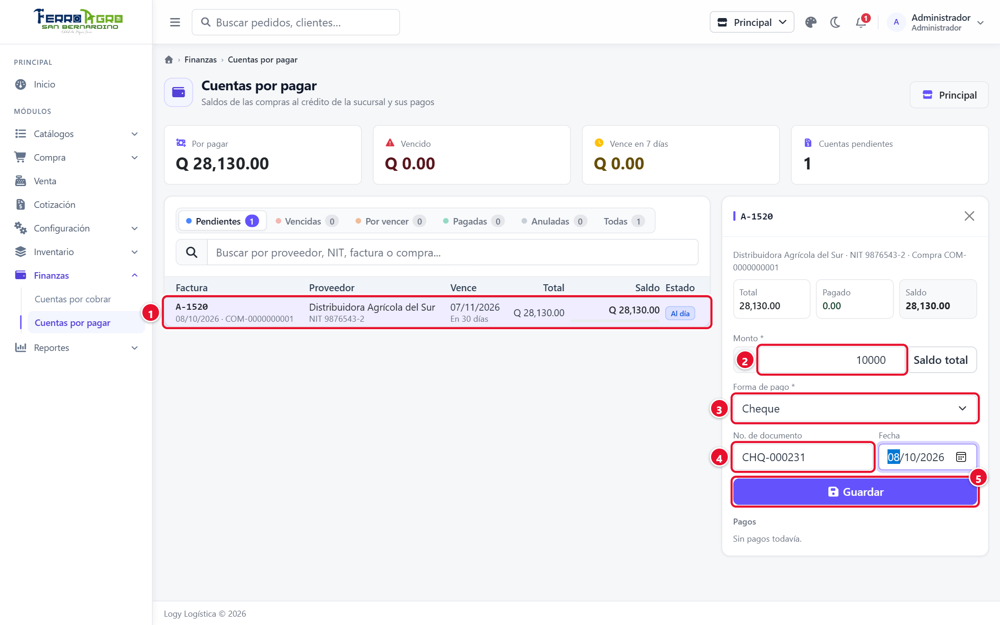
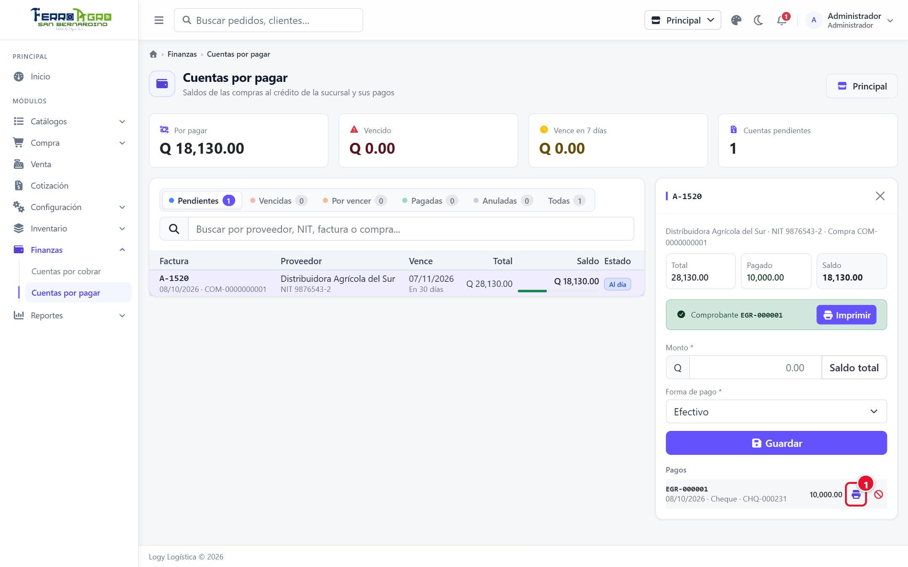
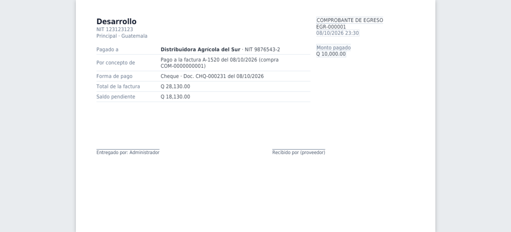

# 7 · Finanzas

[← Índice](README.md)

Menú **Finanzas**. Aquí se cobra lo que los clientes deben y se paga lo que se debe a los proveedores. Las dos pantallas funcionan igual.

Las cuentas **no se crean a mano**: aparecen solas.

- Una **venta al crédito** crea una cuenta por cobrar.
- Una **compra al crédito**, al recibirse, crea una cuenta por pagar.

Las cuentas son de la sucursal de trabajo y las ven todos los usuarios de la sucursal.

## Estados de una cuenta

| Estado | Significado |
|---|---|
| **Al día** | Tiene saldo y faltan más de 7 días para que venza. |
| **Por vencer** | Vence en los próximos 7 días. |
| **Vencida** | Pasó la fecha de vencimiento y todavía tiene saldo. |
| **Pagada** | Saldo en 0. |
| **Anulada** | Se anuló la venta (o la compra) que la originó. |

Arriba de la lista hay indicadores (**Por cobrar** / **Por pagar**, **Vencido**, **Vence en 7 días**, **Cuentas pendientes**) y filtros: **Pendientes**, **Vencidas**, **Por vencer**, **Pagadas**, **Anuladas** y **Todas**. La barra de cada cuenta muestra qué porcentaje ya se pagó.

---

## Cuentas por cobrar

**Finanzas › Cuentas por cobrar**. Busque por cliente, NIT o número de venta. Cada fila muestra la **Venta**, el **Cliente**, el **Total**, el **Saldo** y la fecha en que **Vence** (fecha de la venta + días de crédito del cliente).

<!-- figura -->

- **①** Indicadores: por cobrar, vencido, vence en 7 días y cuentas pendientes.
- **②** Filtros por estado.
- **③** Buscador.
- **④** Cuenta (clic para abonar).

<!-- /figura -->

### Registrar un abono

1. Haga clic en la cuenta. Se abre **Registrar abono** con el **Saldo** y la lista de **Abonos** anteriores.
2. Escriba el **Monto**, o pulse **Saldo total** para liquidar la cuenta completa. No puede ser mayor que el saldo.
3. Elija la **Forma de pago** (Efectivo, Transferencia o Cheque).
4. Si aplica, escriba el **No. de documento** (boleta o cheque) y su **Fecha**.
5. Pulse **Guardar** y confirme con **Registrar**.

<!-- figura -->

- **①** **Monto**.
- **②** **Saldo total**: liquida la cuenta.
- **③** **Forma de pago**.
- **④** **No. de documento** y fecha.
- **⑤** **Guardar**.

<!-- /figura -->

<!-- figura -->

- **①** **Registrar**.

<!-- /figura -->

El sistema genera el **recibo** (ej. `RC-000001`), baja el saldo y, si llega a 0, la venta pasa de **Creado** a **Pagada**. Con **Imprimir** (en cada abono) se imprime el recibo.

<!-- figura -->

- **①** Abono con su recibo (RC-000001).
- **②** Imprimir recibo.
- **③** Anular abono.

<!-- /figura -->

<!-- figura -->

<!-- /figura -->

### Anular un abono

1. En la lista de abonos, pulse **Anular abono**.
2. Escriba el **Motivo** y confirme.

El monto regresa al saldo y, si la venta estaba pagada, vuelve a quedar **Creado** (pendiente de pago).

<!-- figura -->

- **①** **Motivo**.
- **②** **Anular**.

<!-- /figura -->

> Para anular una venta al crédito que tiene abonos, primero hay que anular todos sus abonos.

### Límite de crédito

Lo que el cliente debe en todas sus cuentas vigentes cuenta contra su **Límite de crédito**. Si una venta nueva lo pasaría, el punto de venta no deja registrarla al crédito.

---

## Cuentas por pagar

**Finanzas › Cuentas por pagar**. Busque por proveedor, NIT, factura o número de compra. Cada fila muestra el **Proveedor**, la **Factura**, el **Total**, el **Saldo** y la fecha en que **Vence** (fecha de la factura + días de crédito del proveedor).

### Registrar un pago

1. Haga clic en la cuenta. Se abre **Registrar pago** con el **Saldo** y la lista de **Pagos** anteriores.
2. Escriba el **Monto** o pulse **Saldo total**.
3. Elija la **Forma de pago** y, si aplica, el **No. de documento** (transferencia o cheque) y su **Fecha**.
4. Pulse **Guardar** y confirme con **Registrar**.

<!-- figura -->

- **①** Cuenta de la compra A-1520.
- **②** **Monto**.
- **③** **Forma de pago**.
- **④** **No. de documento** y fecha.
- **⑤** **Guardar**.

<!-- /figura -->

El sistema genera el **comprobante de egreso** (ej. `EGR-000001`) y baja el saldo. Con **Imprimir** se imprime el comprobante en media carta.

<!-- figura -->

- **①** Imprimir el comprobante de egreso.

<!-- /figura -->

<!-- figura -->

<!-- /figura -->

### Anular un pago

Pulse **Anular pago**, escriba el **Motivo** y confirme. El monto regresa al saldo de la cuenta.

> Pagar una cuenta por pagar **no** cambia el estado de la compra: sigue como **Recibida**.
