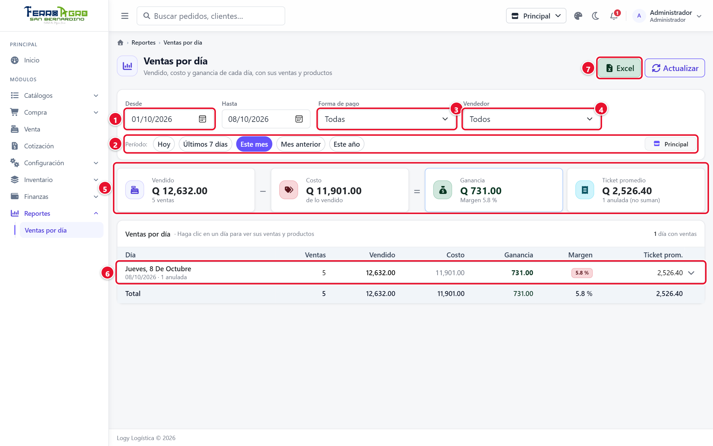
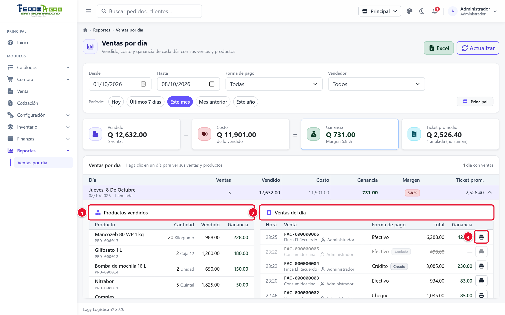

# 8 · Reportes

[← Índice](README.md)

Menú **Reportes**. Informes de consulta; no modifican nada.

## Ventas por día

**Reportes › Ventas por día**. Muestra cuánto se vendió cada día, cuánto costó lo vendido y cuánto se ganó.

### Filtros

- **Desde / Hasta**: por defecto, el mes en curso. Atajos: **Hoy**, **Últimos 7 días**, **Este mes**, **Mes anterior**, **Este año**.
- **Forma de pago**: **Todas** o una en particular.
- **Vendedor**: **Todos** o uno. **Solo administrador**: un usuario que no es administrador ve únicamente sus propias ventas y no tiene este filtro.

El reporte se actualiza solo al cambiar un filtro; **Actualizar** lo vuelve a cargar con los datos más recientes. Haga clic en la flecha de una fila (**Ver detalle**) o en el día para abrir su detalle.

<!-- figura -->

- **①** **Desde / Hasta**.
- **②** Períodos rápidos.
- **③** **Forma de pago**.
- **④** **Vendedor** (solo administrador).
- **⑤** Indicadores: Vendido − Costo = Ganancia y ticket promedio.
- **⑥** Un día (clic para ver su detalle).
- **⑦** **Excel**.

<!-- /figura -->

### Indicadores

- **Vendido − Costo = Ganancia**, con el **margen** (% de ganancia sobre lo vendido).
- **Ticket promedio** (vendido ÷ número de ventas) y cuántas ventas se anularon en el período.

### Tabla por día

Un renglón por cada día **que tuvo ventas**: **Ventas**, **Vendido**, **Costo**, **Ganancia**, **Margen** y **Ticket prom.**, con una fila de totales al final.

El color del margen ayuda a detectar días flojos:

| Color | Margen |
|---|---|
| Rojo | Menor que 10 % |
| Amarillo | De 10 % a menos de 25 % |
| Verde | 25 % o más |

### Detalle de un día

Haga clic en un día (o en **Ver detalle**) para ver:

- **Productos vendidos**: cantidad, vendido, costo y ganancia de cada producto, ordenados de mayor a menor ganancia.
- **Ventas del día**: hora, número, cliente, vendedor, forma de pago, total y ganancia de cada venta. El botón **Ticket** abre la venta para verla o reimprimirla.

<!-- figura -->

- **①** **Productos vendidos**.
- **②** **Ventas del día** (la anulada sale tachada).
- **③** Ver el ticket.

<!-- /figura -->

### Excel

**Excel** descarga el reporte con los mismos filtros, en dos hojas: **Por día** (con margen y ticket promedio) y **Ventas** (una fila por venta).

### Cómo se calcula

- Son las ventas **de la sucursal de trabajo**.
- Las ventas **anuladas** no suman al vendido, al costo ni a la ganancia. Se cuentan aparte y en el detalle se ven tachadas.
- La ganancia es el precio de venta menos el costo del producto **en el momento de la venta**. Si el costo cambió después (por una compra nueva), las ventas anteriores no cambian.
